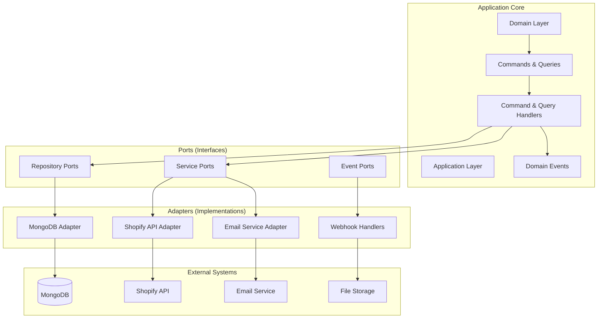
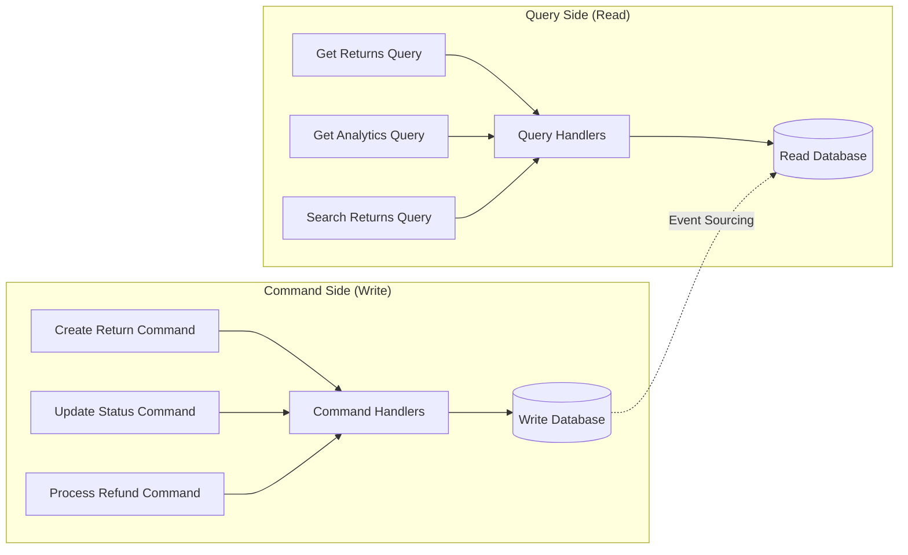
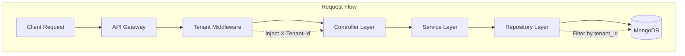
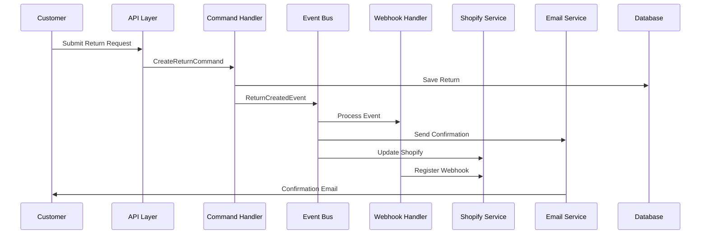

# 🚀 Returns Management SaaS - Elite-Grade Platform

**A comprehensive, production-ready, multi-tenant Returns Management System with advanced Shopify integration, built using Hexagonal Architecture, CQRS, and Domain Events.**

[](https://fastapi.tiangolo.com/)
[](https://reactjs.org/)
[](https://www.mongodb.com/)
[](https://shopify.dev/)
[](LICENSE)

## 🌟 Project Overview

This application is a **production-ready, enterprise-grade Returns Management SaaS** that empowers merchants to handle return requests, process refunds/exchanges, and manage return policies through an intuitive, scalable interface. The system features dedicated customer-facing return portals, comprehensive merchant dashboards, and complete **real-time Shopify integration** for live order data.

### 🎯 Core Business Value
- **Reduce Return Processing Time**: From hours to minutes with automated workflows
- **Increase Customer Satisfaction**: Self-service portals with real-time tracking
- **Scale Operations**: Multi-tenant architecture supporting unlimited merchants
- **Boost Revenue**: Smart analytics and rules engine optimize return-to-exchange ratios

### ✨ Key Features & Capabilities

#### 🏗️ **Elite-Grade Architecture**
- **Hexagonal Architecture (Ports & Adapters)**: Modular, maintainable, and testable design
- **CQRS (Command Query Responsibility Segregation)**: Optimized read/write operations
- **Domain Events**: Event-driven architecture for loose coupling and scalability
- **Multi-Tenant Architecture**: Complete data isolation with enterprise-level security

#### 🛍️ **Shopify Integration Excellence**
- **Real-time OAuth 2.0 Authentication**: Secure merchant onboarding
- **Live Order Synchronization**: GraphQL + REST API integration
- **Webhook Processing**: Real-time event handling for orders, products, and customers
- **Encrypted Credential Management**: Fernet-based security for API tokens

#### 🎛️ **Advanced Returns Processing**
- **Smart Rules Engine**: AI-powered auto-approval and routing logic
- **State Machine Workflow**: Enforced business rules with audit trails
- **Multiple Resolution Types**: Refunds, exchanges, store credit, and repairs
- **Label Generation**: Automated return shipping labels
- **Photo Validation**: AI-powered damage assessment

#### 📊 **Business Intelligence**
- **Real-time Analytics**: Return trends, financial impact, and performance metrics
- **Predictive Insights**: ML-powered return prediction and fraud detection
- **Custom Reporting**: Configurable dashboards and export capabilities
- **Cost Analysis**: ROI tracking and operational cost optimization

#### 🎨 **User Experience Excellence**
- **Customer Portal**: Branded, responsive self-service interface
- **Merchant Dashboard**: Comprehensive management and analytics interface
- **Admin Panel**: Multi-tenant management and system configuration
- **Mobile-First Design**: Optimized for all device sizes and touch interactions

## 📋 Table of Contents

- [🌟 Project Overview](#-project-overview)
- [🏗️ System Architecture](#️-system-architecture)
- [🛠 Technology Stack](#-technology-stack)
- [📊 Database Architecture](#-database-architecture)
- [🔐 Authentication & Security](#-authentication--security)
- [🛍️ Shopify Integration](#️-shopify-integration)
- [📡 API Documentation](#-api-documentation)
- [🎮 Controllers & Endpoints](#-controllers--endpoints)
- [📁 Project Structure](#-project-structure)
- [⚙️ Configuration Management](#️-configuration-management)
- [🚀 Development Setup](#-development-setup)
- [🔧 Advanced Features](#-advanced-features)
- [🧪 Testing Strategy](#-testing-strategy)
- [🚢 Deployment Guide](#-deployment-guide)
- [📈 Monitoring & Observability](#-monitoring--observability)
- [🔍 Troubleshooting](#-troubleshooting)
- [🤝 Contributing](#-contributing)

## 🛠 Tech Stack

### Backend
- **FastAPI** (v0.110.1) - High-performance Python web framework
- **MongoDB** with Motor (async driver) - NoSQL database for scalability
- **Shopify API** (v12.3.0) - E-commerce platform integration
- **Cryptography** (Fernet) - Encryption for sensitive data
- **Pydantic** - Data validation and serialization
- **Aiohttp** - Async HTTP client for external APIs

### Frontend
- **React** (v19.0.0) - Modern UI library
- **React Router DOM** (v7.5.1) - Client-side routing
- **Radix UI** - Accessible component primitives
- **Tailwind CSS** (v3.4.17) - Utility-first CSS framework
- **Lucide React** - Beautiful icon library
- **Axios** - HTTP client for API communication

### Infrastructure
- **Supervisor** - Process management
- **CRACO** - Create React App Configuration Override
- **ESLint & Prettier** - Code quality and formatting

## 🏗️ System Architecture

### **Hexagonal Architecture (Ports & Adapters)**
The application follows Hexagonal Architecture principles for maximum modularity, testability, and maintainability:



### **CQRS (Command Query Responsibility Segregation)**
Separates read and write operations for optimal performance and scalability:



### **Multi-Tenant Architecture**
Enterprise-grade tenant isolation ensuring data security and scalability:



### **Service Communication Architecture**
```
┌─────────────────┐    ┌─────────────────┐    ┌─────────────────┐
│   Customer      │    │   Merchant      │    │   Admin         │
│   Portal        │    │   Dashboard     │    │   Panel         │
│   /returns/*    │    │   /app/*        │    │   /admin/*      │
└─────────────────┘    └─────────────────┘    └─────────────────┘
         │                       │                       │
         └───────────────────────┼───────────────────────┘
                                 │
                    ┌─────────────────┐
                    │   React App     │
                    │   (Port 3000)   │
                    │   ┌───────────┐ │
                    │   │ Nginx     │ │
                    │   │ Ingress   │ │
                    │   └───────────┘ │
                    └─────────────────┘
                                 │
                        ┌────────┴────────┐
                        │                 │
                ┌─────────────────┐ ┌─────────────────┐
                │   FastAPI       │ │   Kubernetes    │
                │   (Port 8001)   │ │   Ingress       │
                │   /api/*        │ │   Controller    │
                └─────────────────┘ └─────────────────┘
                         │                       │
            ┌────────────┼──────────────┐       │
            │            │              │       │
  ┌─────────────┐ ┌─────────────┐ ┌─────────────┐
  │  MongoDB    │ │  Shopify    │ │  External   │
  │ (Port 27017)│ │     API     │ │  Services   │
  │ Multi-Tenant│ │   GraphQL   │ │ (Email, S3) │
  └─────────────┘ └─────────────┘ └─────────────┘
```

### **Event-Driven Architecture**
Domain events enable loose coupling and real-time processing:



## 📋 Prerequisites

- **Python 3.9+** - Backend runtime
- **Node.js 18+** - Frontend development
- **MongoDB 6.0+** - Database server
- **Yarn** - Package manager (DO NOT use npm)
- **Git** - Version control

### System Requirements
- **RAM**: 4GB minimum, 8GB recommended
- **Storage**: 10GB free space
- **OS**: Linux, macOS, or Windows with WSL2

## 🚀 Local Development Setup

### 1. Clone Repository
```bash
git clone <repository-url>
cd returns-management-saas
```

### 2. Backend Setup
```bash
# Navigate to backend directory
cd backend

# Create Python virtual environment
python -m venv venv

# Activate virtual environment
# On Linux/macOS:
source venv/bin/activate
# On Windows:
venv\Scripts\activate

# Install Python dependencies
pip install -r requirements.txt

# Set up environment variables (see Environment Configuration section)
cp .env.example .env
# Edit .env with your configurations
```

### 3. Frontend Setup
```bash
# Navigate to frontend directory (from project root)
cd frontend

# Install Node.js dependencies using Yarn ONLY
yarn install

# Set up environment variables
cp .env.example .env
# Edit .env with your configurations
```

### 4. Database Setup
```bash
# Start MongoDB (if not running as service)
mongod --dbpath /path/to/your/db

# Seed the database with sample data
cd .. # Back to project root
python seed.py
```

## ⚙️ Environment Configuration

### Backend Environment (.env)
```bash
# Database Configuration
MONGO_URL=mongodb://localhost:27017
DB_NAME=returns_management

# Security
CORS_ORIGINS=*
ENCRYPTION_KEY=fernet-key-32-bytes-base64-encoded-here

# Shopify Integration (Production Values)
SHOPIFY_API_KEY=0ef6de8c4bf0b4a3d8f7f99b42c53695
SHOPIFY_API_SECRET=db79f6174721b7acf332b69ef8f84374
SHOPIFY_API_VERSION=2025-07
SHOPIFY_MODE=real
SHOPIFY_REDIRECT_URI=https://your-domain.dev/app/settings/integrations

# Optional Services
OFFLINE_MODE=false
DEBUG=true

# Email Configuration (Optional)
SMTP_HOST=
SMTP_PORT=587
SMTP_USERNAME=
SMTP_PASSWORD=
SMTP_USE_TLS=true
FROM_EMAIL=noreply@returns-manager.com

# AI Services (Optional)
OPENAI_API_KEY=

# Payment Processing (Optional)
STRIPE_API_KEY=
STRIPE_WEBHOOK_SECRET=

# Cloud Storage (Optional)
AWS_ACCESS_KEY_ID=
AWS_SECRET_ACCESS_KEY=
AWS_REGION=us-east-1
AWS_S3_BUCKET=returns-management-labels
```

### Frontend Environment (.env)
```bash
REACT_APP_BACKEND_URL=http://localhost:8001
WDS_SOCKET_PORT=443
```

**⚠️ CRITICAL**: Never modify the `REACT_APP_BACKEND_URL` or `MONGO_URL` in production. These are automatically configured for the deployment environment.

## 🏃‍♂️ Running the Application

### Development Mode

#### Option 1: Using Supervisor (Recommended)
```bash
# Start all services
sudo supervisorctl restart all

# Check service status
sudo supervisorctl status

# View logs
sudo supervisorctl tail -f backend
sudo supervisorctl tail -f frontend
```

#### Option 2: Manual Start
```bash
# Terminal 1: Start Backend
cd backend
source venv/bin/activate
uvicorn server:app --host 0.0.0.0 --port 8001 --reload

# Terminal 2: Start Frontend
cd frontend
yarn start

# Terminal 3: Start MongoDB (if not running as service)
mongod --dbpath /path/to/your/db
```

### Service URLs
- **Frontend**: http://localhost:3000
- **Backend API**: http://localhost:8001
- **API Documentation**: http://localhost:8001/docs
- **MongoDB**: mongodb://localhost:27017

### Application Routes
- **Customer Portal**: http://localhost:3000/returns
- **Merchant Dashboard**: http://localhost:3000/app
- **Admin Panel**: http://localhost:3000/admin

## 📚 API Documentation

### Base URL
```
http://localhost:8001/api
```

### Authentication
All API endpoints require the `X-Tenant-Id` header for multi-tenant isolation:
```bash
curl -H "X-Tenant-Id: tenant-fashion-store" http://localhost:8001/api/returns
```

### Core Endpoints

#### Tenant Management
```bash
# Create Tenant
POST /api/tenants
{
  "name": "Fashion Store",
  "domain": "fashion-store.com",
  "shopify_store_url": "fashion-store.myshopify.com"
}

# Get Tenants
GET /api/tenants

# Get Tenant Settings
GET /api/tenants/{tenant_id}/settings

# Update Tenant Settings
PUT /api/tenants/{tenant_id}/settings
```

#### Orders API
```bash
# Get Paginated Orders
GET /api/orders?page=1&limit=20&search=john&status_filter=paid

# Get Order Details
GET /api/orders/{order_id}

# Customer Order Lookup
POST /api/orders/lookup
{
  "order_number": "ORD-001",
  "email": "customer@email.com"
}
```

#### Returns Management
```bash
# Create Return Request
POST /api/returns
{
  "order_id": "uuid",
  "reason": "defective",
  "items_to_return": [...],
  "notes": "Product arrived damaged"
}

# Get Returns (Paginated)
GET /api/returns?page=1&limit=20&status_filter=approved&search=john

# Update Return Status
PUT /api/returns/{return_id}/status
{
  "status": "approved",
  "notes": "Approved for return",
  "tracking_number": "TRK123456"
}

# Process Resolution
POST /api/returns/{return_id}/resolve
{
  "resolution_type": "refund",
  "refund_method": "original_payment",
  "notes": "Full refund processed"
}

# Get Audit Log
GET /api/returns/{return_id}/audit-log
```

#### Rules Engine
```bash
# Create Return Rule
POST /api/return-rules
{
  "name": "Auto-approve defective items",
  "description": "Automatically approve returns for defective products",
  "conditions": {
    "auto_approve_reasons": ["defective", "damaged_in_shipping"],
    "max_days_since_order": 30
  },
  "actions": {
    "auto_approve": true,
    "generate_label": true
  },
  "priority": 1
}

# Simulate Rules
POST /api/return-rules/simulate
{
  "order_data": {...},
  "return_data": {...}
}
```

#### Analytics
```bash
# Get Analytics
GET /api/analytics?days=30

# Response:
{
  "total_returns": 45,
  "total_refunds": 2500.00,
  "exchange_rate": 15.5,
  "avg_processing_time": 2.5,
  "top_return_reasons": [
    {"reason": "defective", "count": 20, "percentage": 44.4}
  ]
}
```

#### Shopify Integration
```bash
# Auth Service Status
GET /api/auth/status

# Validate Credentials
POST /api/auth/test/validate
{
  "shop_domain": "demo-store",
  "api_key": "your-api-key",
  "api_secret": "your-api-secret"
}

# Initiate OAuth
POST /api/auth/initiate
{
  "shop": "demo-store",
  "api_key": "your-api-key",
  "api_secret": "your-api-secret"
}

# Connectivity Test
GET /api/shopify-test/quick-test?shop=demo-store
```

### Response Format
All API responses follow this structure:
```json
{
  "success": true,
  "data": {...},
  "pagination": {
    "current_page": 1,
    "total_pages": 5,
    "total_items": 100,
    "per_page": 20
  },
  "message": "Operation successful"
}
```

### Error Handling
```json
{
  "success": false,
  "error": {
    "code": "VALIDATION_ERROR",
    "message": "Invalid input data",
    "details": {...}
  }
}
```

## 📁 Project Structure

```
/app/
├── backend/                    # FastAPI Backend
│   ├── src/
│   │   ├── config/            # Configuration management
│   │   ├── controllers/       # API route controllers
│   │   │   ├── returns_controller.py
│   │   │   ├── shopify_controller.py
│   │   │   ├── webhook_controller.py
│   │   │   └── testing_controller.py
│   │   ├── models/           # Pydantic data models
│   │   ├── services/         # Business logic layer
│   │   │   ├── shopify_service.py
│   │   │   ├── shopify_graphql.py
│   │   │   ├── sync_service.py
│   │   │   ├── webhook_handlers.py
│   │   │   ├── ai_service.py
│   │   │   └── email_service.py
│   │   ├── utils/           # Utility functions
│   │   │   ├── rules_engine.py
│   │   │   ├── state_machine.py
│   │   │   └── dependencies.py
│   │   ├── modules/         # Feature modules
│   │   │   ├── auth/       # Authentication & OAuth
│   │   │   ├── returns/    # Returns management
│   │   │   ├── rules/      # Rules engine
│   │   │   └── stores/     # Store management
│   │   ├── repositories/   # Data access layer
│   │   └── middleware/     # Security & validation
│   │       └── security.py
│   ├── requirements.txt    # Python dependencies
│   ├── server.py          # FastAPI app entry point
│   └── .env              # Environment variables
│
├── frontend/              # React Frontend
│   ├── src/
│   │   ├── components/   # Reusable UI components
│   │   │   ├── ui/      # Base UI components
│   │   │   └── layout/  # Layout components
│   │   │       ├── MerchantLayout.jsx
│   │   │       ├── CustomerLayout.jsx
│   │   │       ├── SearchBar.jsx
│   │   │       └── TenantSwitcher.jsx
│   │   ├── pages/       # Route components
│   │   │   ├── customer/    # Customer portal
│   │   │   │   ├── Start.jsx
│   │   │   │   ├── SelectItems.jsx
│   │   │   │   ├── ResolutionStep.jsx
│   │   │   │   ├── Confirm.jsx
│   │   │   │   └── StatusTracker.jsx
│   │   │   ├── merchant/    # Merchant dashboard
│   │   │   │   ├── Dashboard.js
│   │   │   │   ├── Orders.jsx
│   │   │   │   ├── OrderDetail.jsx
│   │   │   │   ├── Rules.jsx
│   │   │   │   ├── Analytics.jsx
│   │   │   │   ├── returns/
│   │   │   │   │   ├── AllReturns.jsx
│   │   │   │   │   └── ReturnDetail.jsx
│   │   │   │   └── settings/
│   │   │   │       ├── General.jsx
│   │   │   │       ├── Integrations.jsx
│   │   │   │       ├── Branding.jsx
│   │   │   │       ├── Email.jsx
│   │   │   │       └── TeamAndRoles.jsx
│   │   │   └── admin/       # Admin interface
│   │   ├── App.jsx         # Main app component
│   │   └── App.css        # Global styles
│   ├── package.json       # Node.js dependencies
│   ├── tailwind.config.js # Tailwind configuration
│   └── .env              # Frontend environment
│
├── docs/                 # Documentation
│   ├── DATABASE_SCHEMA.md
│   ├── ENHANCED_FEATURES_SETUP.md
│   └── VERIFICATION_LOG.md
│
├── mock_data/           # Sample data files
├── tests/              # Test suites
├── seed.py            # Database seeding script
├── test_result.md     # Testing logs
└── README.md         # This file
```

## 🔧 Key Components

### Backend Components

#### 1. Security Middleware (`src/middleware/security.py`)
- **Tenant Validation**: Ensures all requests include valid `X-Tenant-Id`
- **Rate Limiting**: Prevents API abuse
- **Audit Logging**: Tracks all API access
- **CORS**: Handles cross-origin requests

#### 2. Rules Engine (`src/utils/rules_engine.py`)
- **Configurable Logic**: JSON-based rule definitions
- **Simulation**: Test rules before applying
- **Step-by-step Explanation**: Detailed rule evaluation
- **Priority System**: Execute rules in order

#### 3. State Machine (`src/utils/state_machine.py`)
- **Valid Transitions**: Enforces business rules
- **Audit Trail**: Tracks status changes
- **Idempotent Operations**: Prevents duplicate state changes

#### 4. Shopify Integration (`src/modules/auth/service.py`)
- **OAuth 2.0 Flow**: Secure merchant authentication
- **Credential Encryption**: Fernet-based token security
- **Webhook Registration**: Automatic webhook setup
- **Data Synchronization**: Real-time order sync

### Frontend Components

#### 1. Layout System
- **MerchantLayout**: Dashboard navigation and tenant switching
- **CustomerLayout**: Clean, branded customer interface
- **Responsive Design**: Mobile-first approach

#### 2. State Management
- **React Context**: Global state for user/tenant data
- **Local Storage**: Persistence for user preferences
- **Error Boundaries**: Graceful error handling

#### 3. API Integration
- **Axios Client**: Centralized HTTP handling
- **Request Interceptors**: Automatic tenant header injection
- **Error Handling**: User-friendly error messages

## 📊 Database Schema

### Core Collections

#### tenants
```javascript
{
  "_id": "tenant-fashion-store",
  "name": "Fashion Forward", 
  "domain": "fashionforward.com",
  "shopify_store_url": "fashion-forward.myshopify.com",
  "plan": "pro",
  "settings": {
    "return_window_days": 30,
    "auto_approve_exchanges": true,
    "require_photos": true,
    "brand_color": "#e11d48"
  },
  "created_at": "2025-01-01T00:00:00Z",
  "is_active": true
}
```

#### orders (Real Shopify Data)
```javascript
{
  "_id": "order-uuid",
  "tenant_id": "tenant-fashion-store",
  "order_id": "shopify-order-123",
  "order_number": "#1001",
  "customer_name": "John Smith",
  "customer_email": "john@email.com",
  "financial_status": "paid",
  "fulfillment_status": "fulfilled",
  "total_price": 159.99,
  "line_items": [...],
  "created_at": "2025-01-15T10:00:00Z"
}
```

#### return_requests
```javascript
{
  "_id": "return-uuid",
  "tenant_id": "tenant-fashion-store",
  "order_id": "order-uuid",
  "customer_name": "John Smith",
  "reason": "defective",
  "status": "approved",
  "items_to_return": [...],
  "refund_amount": 79.99,
  "tracking_number": "TRK123456",
  "created_at": "2025-01-20T14:30:00Z"
}
```

#### return_rules
```javascript
{
  "_id": "rule-uuid",
  "tenant_id": "tenant-fashion-store",
  "name": "Auto-approve defective items",
  "conditions": {
    "auto_approve_reasons": ["defective", "damaged_in_shipping"],
    "max_days_since_order": 30
  },
  "actions": {
    "auto_approve": true,
    "generate_label": true
  },
  "priority": 1,
  "is_active": true
}
```

### Indexes
```javascript
// Performance-optimized indexes
db.tenants.createIndex({"id": 1})
db.orders.createIndex({"tenant_id": 1, "order_number": 1})
db.return_requests.createIndex({"tenant_id": 1, "status": 1})
db.return_rules.createIndex({"tenant_id": 1, "priority": 1})
```

## 🧪 Testing

### Seed Sample Data
```bash
# Generate comprehensive test data
python seed.py

# This creates:
# - 2 tenants with different configurations
# - 50+ products across categories  
# - 30+ orders from various customers
# - 20+ returns in different states
# - Return rules covering various scenarios
```

### Manual Testing Scenarios

#### 1. Customer Return Flow
1. Visit http://localhost:3000/returns
2. Enter order number and email
3. Select items to return
4. Choose return reason
5. Submit return request
6. Track return status

#### 2. Merchant Dashboard
1. Visit http://localhost:3000/app
2. View dashboard with KPIs
3. Manage returns (approve/deny)
4. Configure return rules
5. View analytics and reports

#### 3. Shopify Integration
1. Go to Settings > Integrations
2. Enter Shopify store details
3. Complete OAuth flow
4. Verify data synchronization
5. Test webhook processing

### API Testing
```bash
# Health check
curl http://localhost:8001/health

# Get returns for a tenant
curl -H "X-Tenant-Id: tenant-fashion-store" \
     http://localhost:8001/api/returns

# Create a return request
curl -X POST \
     -H "X-Tenant-Id: tenant-fashion-store" \
     -H "Content-Type: application/json" \
     -d '{"order_id":"uuid","reason":"defective","items_to_return":[...]}' \
     http://localhost:8001/api/returns
```

### Backend Testing
```bash
# Run unit tests
cd backend
python -m pytest tests/ -v

# Run with coverage
python -m pytest tests/ --cov=src --cov-report=html

# Load testing
locust -f tests/load_test.py --host=http://localhost:8001
```

### Frontend Testing
```bash
# Run unit tests
cd frontend
yarn test

# Run E2E tests
yarn test:e2e

# Component testing
yarn test:components
```

## 🚀 Deployment

### Production Checklist

#### Security
- [ ] Update `ENCRYPTION_KEY` with strong 32-byte key
- [ ] Set secure `CORS_ORIGINS` (not *)
- [ ] Configure HTTPS certificates
- [ ] Enable MongoDB authentication
- [ ] Set up firewall rules

#### Environment Variables
```bash
# Production Backend .env
MONGO_URL=mongodb://prod-server:27017/returns_prod
DB_NAME=returns_management_prod
CORS_ORIGINS=https://yourdomain.com,https://app.yourdomain.com
ENCRYPTION_KEY=your-32-byte-base64-encoded-key
DEBUG=false
SHOPIFY_REDIRECT_URI=https://yourdomain.com/auth/callback
```

#### Database
```bash
# Create production database
mongorestore --uri="mongodb://prod-server:27017/returns_prod" backup/

# Set up indexes
mongo returns_prod --eval "
  db.tenants.createIndex({'id': 1});
  db.orders.createIndex({'tenant_id': 1, 'order_number': 1});
  db.return_requests.createIndex({'tenant_id': 1, 'status': 1});
"
```

#### Process Management
```bash
# Production supervisor config
[program:returns-backend]
command=/path/to/venv/bin/uvicorn server:app --host 0.0.0.0 --port 8001
directory=/path/to/backend
user=www-data
autostart=true
autorestart=true

[program:returns-frontend]
command=yarn start
directory=/path/to/frontend
user=www-data
autostart=true
autorestart=true
```

### Docker Deployment
```dockerfile
# Dockerfile.backend
FROM python:3.11-slim
WORKDIR /app
COPY requirements.txt .
RUN pip install -r requirements.txt
COPY . .
CMD ["uvicorn", "server:app", "--host", "0.0.0.0", "--port", "8001"]

# Dockerfile.frontend  
FROM node:18-alpine
WORKDIR /app
COPY package.json yarn.lock ./
RUN yarn install
COPY . .
RUN yarn build
CMD ["yarn", "start"]
```

```yaml
# docker-compose.yml
version: '3.8'
services:
  backend:
    build: ./backend
    ports:
      - "8001:8001"
    environment:
      - MONGO_URL=mongodb://mongo:27017
    depends_on:
      - mongo
      
  frontend:
    build: ./frontend
    ports:
      - "3000:3000"
    environment:
      - REACT_APP_BACKEND_URL=http://localhost:8001
      
  mongo:
    image: mongo:6.0
    ports:
      - "27017:27017"
    volumes:
      - mongo_data:/data/db
      
volumes:
  mongo_data:
```

### Cloud Deployment (AWS)
```bash
# Install AWS CLI and configure
aws configure

# Deploy using Elastic Beanstalk
eb init returns-management-saas
eb create production
eb deploy

# Or use ECS with Fargate
aws ecs create-cluster --cluster-name returns-saas
aws ecs register-task-definition --cli-input-json file://task-definition.json
```

## 🔍 Troubleshooting

### Common Issues

#### 1. MongoDB Connection Failed
```bash
# Check MongoDB status
sudo systemctl status mongod

# Start MongoDB
sudo systemctl start mongod

# Check connection
mongo --eval "db.adminCommand('ismaster')"
```

#### 2. Frontend Not Loading
```bash
# Clear node modules and reinstall
cd frontend
rm -rf node_modules yarn.lock
yarn install

# Check port conflicts
lsof -i :3000
```

#### 3. API Requests Failing
```bash
# Check backend logs
sudo supervisorctl tail -f backend

# Verify CORS settings
curl -H "Origin: http://localhost:3000" \
     -H "X-Tenant-Id: tenant-fashion-store" \
     http://localhost:8001/api/health
```

#### 4. Shopify Integration Issues
```bash
# Verify credentials
curl -X POST \
     -H "Content-Type: application/json" \
     -d '{"shop_domain":"your-shop","api_key":"key","api_secret":"secret"}' \
     http://localhost:8001/api/auth/test/validate

# Check webhook endpoints
curl http://localhost:8001/api/webhooks/health
```

#### 5. Database Seeding Failed
```bash
# Clear database and reseed
mongo returns_management --eval "db.dropDatabase()"
python seed.py

# Check seed results
mongo returns_management --eval "
  print('Tenants:', db.tenants.count());
  print('Products:', db.products.count());
  print('Orders:', db.orders.count());
  print('Returns:', db.return_requests.count());
"
```

### Performance Issues

#### Slow API Responses
```bash
# Check database indexes
mongo returns_management --eval "db.return_requests.getIndexes()"

# Monitor query performance
mongo returns_management --eval "db.setProfilingLevel(2)"

# Check slow queries
mongo returns_management --eval "db.system.profile.find().limit(5).sort({ts:-1}).pretty()"
```

#### Memory Usage
```bash
# Monitor Python processes
ps aux | grep python

# Monitor Node.js processes  
ps aux | grep node

# Check MongoDB memory
mongo --eval "db.serverStatus().mem"
```

### Logs and Debugging

#### Backend Logs
```bash
# Supervisor logs
sudo supervisorctl tail -f backend stderr
sudo supervisorctl tail -f backend stdout

# Direct logs
tail -f /var/log/supervisor/backend.err.log
tail -f /var/log/supervisor/backend.out.log
```

#### Frontend Logs
```bash
# Browser console for frontend errors
# Chrome DevTools -> Console

# React dev server logs
sudo supervisorctl tail -f frontend

# Build errors
cd frontend && yarn build
```

#### Database Logs
```bash
# MongoDB logs
sudo tail -f /var/log/mongodb/mongod.log

# Query logs
mongo returns_management --eval "db.setProfilingLevel(1, {slowms: 100})"
```

## 📞 Support & Contribution

### Getting Help
- **Documentation**: Check `/docs` directory for detailed guides
- **API Reference**: http://localhost:8001/docs (when running)
- **Issues**: Report bugs and feature requests via GitHub Issues

### Development Guidelines
- **Code Style**: Follow PEP 8 for Python, ESLint for JavaScript
- **Testing**: Write tests for new features
- **Documentation**: Update README and API docs for changes
- **Security**: Never commit credentials or sensitive data

### Contributing
1. Fork the repository
2. Create feature branch: `git checkout -b feature/amazing-feature`
3. Commit changes: `git commit -m 'Add amazing feature'`
4. Push to branch: `git push origin feature/amazing-feature`
5. Open Pull Request

---

## 📄 License

This project is licensed under the MIT License - see the LICENSE file for details.

## 🙏 Acknowledgments

- **Shopify** for comprehensive API documentation
- **FastAPI** community for excellent framework
- **React** ecosystem for modern frontend tools
- **Tailwind CSS** for utility-first styling
- **MongoDB** for flexible document storage

---

**Built with ❤️ for modern e-commerce returns management**
