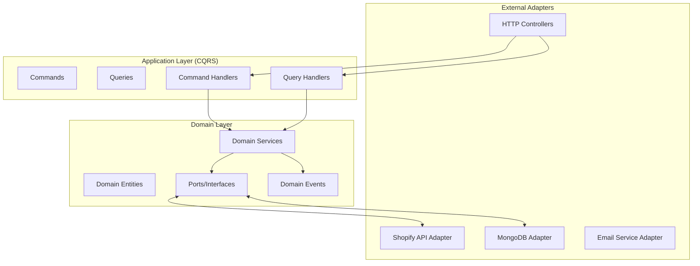
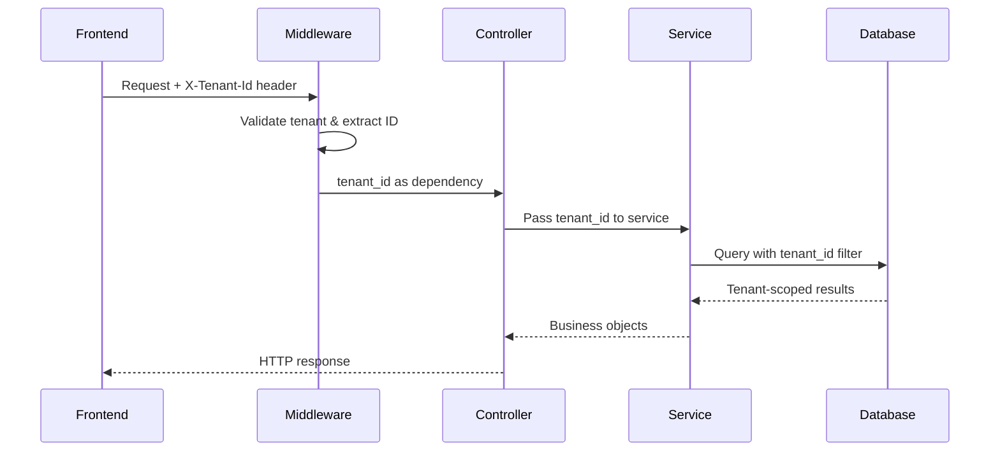
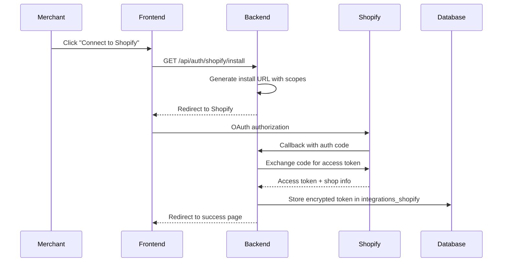
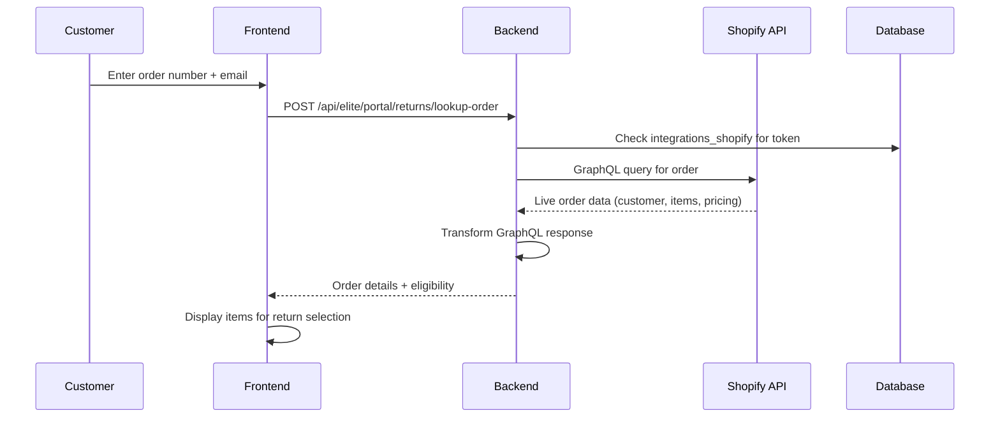
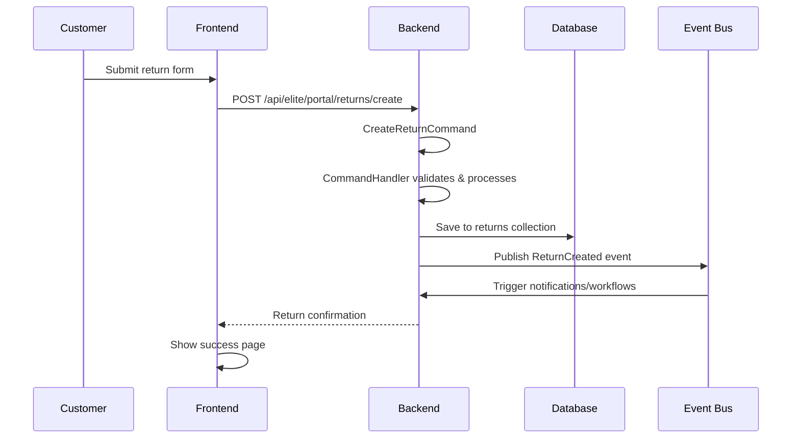
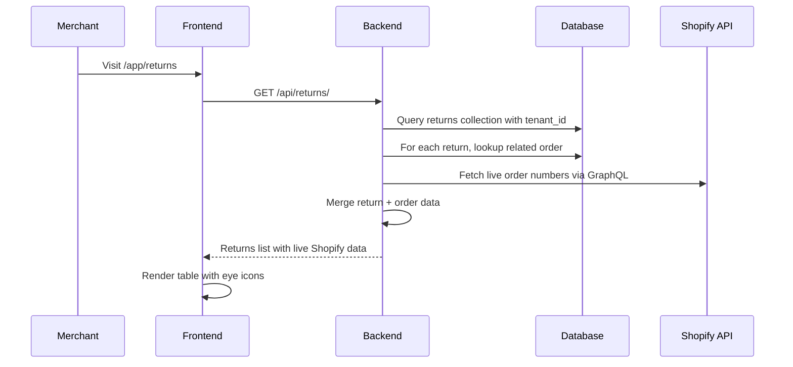
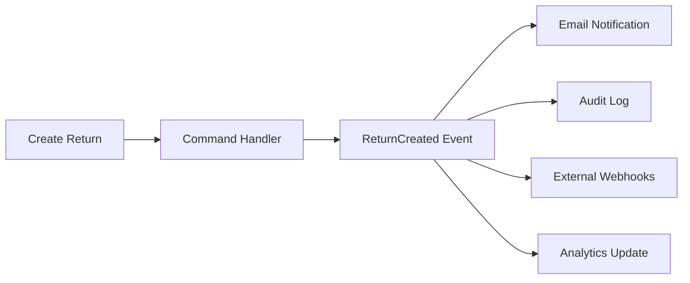

# System Architecture

*Last updated: 2025-01-11*

## Overview

This Returns Management SaaS follows **Hexagonal Architecture** (Ports & Adapters) with **CQRS** (Command Query Responsibility Segregation) patterns for clean separation of concerns and testability.

## Architecture Patterns

### Hexagonal Architecture Implementation



### File Structure Mapping

```
backend/src/
├── controllers/          # External HTTP Adapters
│   ├── elite_portal_returns_controller.py
│   └── returns_controller_enhanced.py
├── application/          # CQRS Application Layer
│   ├── commands.py       # Write operations
│   ├── queries.py        # Read operations
│   └── handlers/
│       ├── command_handlers.py
│       └── query_handlers.py
├── domain/              # Core Business Logic
│   ├── entities/        # Business entities
│   ├── services/        # Domain services
│   ├── ports/           # Interfaces to external world
│   ├── value_objects.py # Immutable value objects
│   └── events.py        # Domain events
└── infrastructure/      # External Adapters Implementation
    ├── repositories/    # Data persistence adapters
    └── services/        # External service adapters
```

## Multi-tenancy Design

Every operation is scoped by `tenant_id`:



**Implementation Details:**
- `middleware/security.py`: Extracts and validates `X-Tenant-Id`
- All database queries include `{"tenant_id": tenant_id}` filter
- No cross-tenant data leakage possible

## Key Flows

### 1. Shopify OAuth Installation



**File Locations:**
- Controller: `controllers/shopify_integration_controller.py`
- Service: `services/shopify_service.py`
- Auth handling: `modules/auth/service.py`

### 2. Real-time Order Lookup (Customer Portal)



**GraphQL Query Used:**
- `order(id: "gid://shopify/Order/{order_id}")` 
- Fields: customer, lineItems, totalPrice, createdAt
- File: `services/shopify_service.py:find_order_by_number()`

### 3. Return Creation Flow



**CQRS Implementation:**
- Command: `application/commands.py:CreateReturnCommand`
- Handler: `application/handlers/command_handlers.py:CreateReturnCommandHandler`
- Repository: `infrastructure/repositories/mongo_return_repository.py`

### 4. Merchant Dashboard Data Loading



**Data Enhancement:**
- Base data from `returns` collection
- Order numbers fetched live from Shopify GraphQL
- Customer names derived from Shopify customer data
- File: `controllers/returns_controller_enhanced.py`

## Event-Driven Architecture

Domain events enable loose coupling:



**Event Types:**
- `ReturnCreated`: New return request submitted
- `ReturnApproved`: Merchant approved return
- `ReturnProcessed`: Refund issued
- `OrderSynced`: Shopify order data updated

**Implementation:**
- Events: `domain/events.py`
- Publishers: Domain services emit events
- Subscribers: Infrastructure services handle events

## Performance & Scalability

### Caching Strategy
- **Redis**: Session data, temporary tokens
- **Application Cache**: Shopify GraphQL responses (5 min TTL)
- **Database Indexes**: On tenant_id, created_at, status fields

### Database Design
- **Sharding**: By tenant_id for horizontal scaling
- **Read Replicas**: Analytics queries use read-only replicas
- **Connection Pooling**: MongoDB motor async driver

### API Rate Limiting
- **Shopify API**: Respects cost analysis, implements backoff
- **Public APIs**: Rate limited per tenant (100/min default)
- **File Uploads**: Chunked uploads for large files

## Security Layers

### Authentication & Authorization
1. **Shopify OAuth**: Validates merchant identity
2. **Tenant Validation**: Every request requires valid tenant_id
3. **API Scopes**: Different endpoints require different Shopify scopes
4. **Secrets Management**: All tokens encrypted at rest

### Data Protection
- **Encryption**: Access tokens encrypted with Fernet
- **PII Handling**: Customer data minimized, logged carefully
- **Audit Trail**: All data changes logged with user context

---

**Next**: See [API.md](./API.md) for detailed endpoint documentation.