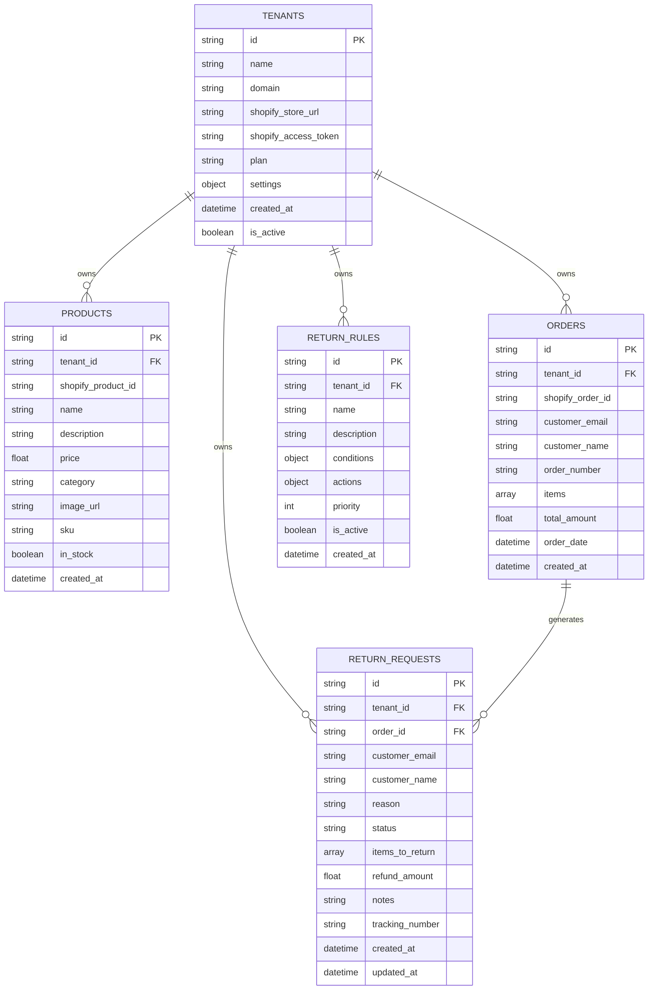

# Database Schema Documentation

## Overview

The Returns Management SaaS uses MongoDB as its database with a multi-tenant architecture. Each document includes a `tenant_id` field to ensure data isolation between tenants.

## Entity Relationship Diagram (ERD)



## Collections Detail

### 1. TENANTS
**Purpose**: Stores merchant/client information for multi-tenant isolation

| Field | Type | Description | Required | Default |
|-------|------|-------------|----------|---------|
| id | string | Unique tenant identifier (UUID) | ✅ | Auto-generated |
| name | string | Tenant business name | ✅ | - |
| domain | string | Tenant's domain | ✅ | - |
| shopify_store_url | string | Shopify store URL | ❌ | null |
| shopify_access_token | string | Encrypted Shopify access token | ❌ | null |
| plan | string | Subscription plan (trial/basic/pro/enterprise) | ✅ | "trial" |
| settings | object | Tenant-specific configuration | ✅ | Default settings |
| created_at | datetime | Creation timestamp | ✅ | Auto-generated |
| is_active | boolean | Tenant status | ✅ | true |

**Indexes**:
- Primary: `id`
- Secondary: `domain` (unique)
- Query: `is_active`

**Sample Document**:
```json
{
  "_id": "uuid-tenant-123",
  "name": "Demo Store",
  "domain": "demo-store.com",
  "shopify_store_url": "demo-store.myshopify.com",
  "plan": "trial",
  "settings": {
    "return_window_days": 30,
    "auto_approve_exchanges": true,
    "require_photos": false,
    "brand_color": "#3b82f6",
    "custom_message": "We're here to help with your return!"
  },
  "created_at": "2025-01-01T00:00:00Z",
  "is_active": true
}
```

### 2. PRODUCTS
**Purpose**: Stores product catalog for each tenant

| Field | Type | Description | Required | Default |
|-------|------|-------------|----------|---------|
| id | string | Unique product identifier (UUID) | ✅ | Auto-generated |
| tenant_id | string | Reference to tenant | ✅ | - |
| shopify_product_id | string | Shopify product ID | ❌ | null |
| name | string | Product name | ✅ | - |
| description | string | Product description | ❌ | null |
| price | float | Product price | ✅ | - |
| category | string | Product category | ✅ | - |
| image_url | string | Product image URL | ❌ | null |
| sku | string | Stock Keeping Unit | ✅ | - |
| in_stock | boolean | Stock availability | ✅ | true |
| created_at | datetime | Creation timestamp | ✅ | Auto-generated |

**Indexes**:
- Primary: `id`
- Compound: `tenant_id, sku` (unique per tenant)
- Query: `tenant_id, category`

### 3. ORDERS
**Purpose**: Stores customer orders for return processing

| Field | Type | Description | Required | Default |
|-------|------|-------------|----------|---------|
| id | string | Unique order identifier (UUID) | ✅ | Auto-generated |
| tenant_id | string | Reference to tenant | ✅ | - |
| shopify_order_id | string | Shopify order ID | ❌ | null |
| customer_email | string | Customer email address | ✅ | - |
| customer_name | string | Customer full name | ✅ | - |
| order_number | string | Human-readable order number | ✅ | - |
| items | array | Array of OrderItem objects | ✅ | - |
| total_amount | float | Order total value | ✅ | - |
| order_date | datetime | Original order date | ✅ | - |
| created_at | datetime | Record creation timestamp | ✅ | Auto-generated |

**OrderItem Structure**:
```json
{
  "product_id": "string",
  "product_name": "string", 
  "quantity": "number",
  "price": "number",
  "sku": "string"
}
```

**Indexes**:
- Primary: `id`
- Compound: `tenant_id, order_number` (unique per tenant)
- Query: `tenant_id, customer_email`

### 4. RETURN_REQUESTS
**Purpose**: Stores return requests and their status

| Field | Type | Description | Required | Default |
|-------|------|-------------|----------|---------|
| id | string | Unique return identifier (UUID) | ✅ | Auto-generated |
| tenant_id | string | Reference to tenant | ✅ | - |
| order_id | string | Reference to original order | ✅ | - |
| customer_email | string | Customer email address | ✅ | - |
| customer_name | string | Customer full name | ✅ | - |
| reason | string | Return reason (enum) | ✅ | - |
| status | string | Return status (enum) | ✅ | "requested" |
| items_to_return | array | Array of OrderItem objects | ✅ | - |
| refund_amount | float | Calculated refund amount | ✅ | 0.0 |
| notes | string | Additional notes/comments | ❌ | null |
| tracking_number | string | Return shipping tracking | ❌ | null |
| created_at | datetime | Creation timestamp | ✅ | Auto-generated |
| updated_at | datetime | Last update timestamp | ✅ | Auto-generated |

**Return Reasons** (Enum):
- `defective` - Product is defective
- `wrong_size` - Incorrect size
- `wrong_color` - Incorrect color
- `not_as_described` - Product doesn't match description
- `damaged_in_shipping` - Damaged during shipping
- `changed_mind` - Customer changed mind
- `quality_issues` - General quality issues

**Return Status** (Enum):
- `requested` - Initial request
- `approved` - Approved by merchant
- `denied` - Denied by merchant
- `in_transit` - Items being returned
- `received` - Items received by merchant
- `processed` - Processing complete
- `refunded` - Refund issued
- `exchanged` - Exchange processed

**Indexes**:
- Primary: `id`
- Compound: `tenant_id, status`
- Query: `tenant_id, customer_email`
- Text Search: `customer_name, customer_email, order_id`

### 5. RETURN_RULES
**Purpose**: Stores configurable business rules for automated return processing

| Field | Type | Description | Required | Default |
|-------|------|-------------|----------|---------|
| id | string | Unique rule identifier (UUID) | ✅ | Auto-generated |
| tenant_id | string | Reference to tenant | ✅ | - |
| name | string | Human-readable rule name | ✅ | - |
| description | string | Rule description | ✅ | - |
| conditions | object | JSON conditions for rule matching | ✅ | - |
| actions | object | JSON actions to execute | ✅ | - |
| priority | int | Rule priority (lower = higher priority) | ✅ | 1 |
| is_active | boolean | Rule status | ✅ | true |
| created_at | datetime | Creation timestamp | ✅ | Auto-generated |

**Condition Examples**:
```json
{
  "max_days_since_order": 30,
  "auto_approve_reasons": ["defective", "damaged_in_shipping"],
  "require_manual_review_reasons": ["changed_mind"]
}
```

**Action Examples**:
```json
{
  "auto_approve": true,
  "generate_label": true,
  "send_notification": true
}
```

**Indexes**:
- Primary: `id`
- Compound: `tenant_id, priority` (for rule ordering)
- Query: `tenant_id, is_active`

## Multi-Tenant Data Isolation

### Implementation Strategy
1. **Tenant ID Required**: Every document (except tenants) includes `tenant_id`
2. **Middleware Enforcement**: All API queries automatically filter by `tenant_id`
3. **Header Validation**: `X-Tenant-Id` header required for all tenant-scoped endpoints
4. **Database Constraints**: Compound indexes prevent cross-tenant data leakage

### Security Considerations
- Tenant IDs are UUIDs to prevent enumeration
- All queries are scoped by tenant_id at the database level
- No shared data between tenants
- Cascade delete when tenant is deactivated

## Relationships and Constraints

### Primary Relationships
1. **Tenant → Products**: One-to-many (tenant owns products)
2. **Tenant → Orders**: One-to-many (tenant owns orders)
3. **Tenant → Returns**: One-to-many (tenant owns returns)
4. **Tenant → Rules**: One-to-many (tenant owns rules)
5. **Order → Returns**: One-to-many (order can have multiple returns)

### Referential Integrity
- Foreign key relationships enforced at application level
- Cascade behaviors defined in service layer
- Orphaned record cleanup via scheduled jobs

### Data Consistency
- Return amounts calculated from order items
- Status transitions validated via state machine
- Rules applied in priority order
- Analytics computed from return data

## Performance Optimizations

### Indexing Strategy
```javascript
// Tenants
db.tenants.createIndex({ "id": 1 })
db.tenants.createIndex({ "domain": 1 }, { unique: true })
db.tenants.createIndex({ "is_active": 1 })

// Products  
db.products.createIndex({ "tenant_id": 1, "sku": 1 }, { unique: true })
db.products.createIndex({ "tenant_id": 1, "category": 1 })

// Orders
db.orders.createIndex({ "tenant_id": 1, "order_number": 1 }, { unique: true })
db.orders.createIndex({ "tenant_id": 1, "customer_email": 1 })
db.orders.createIndex({ "tenant_id": 1, "order_date": -1 })

// Return Requests
db.return_requests.createIndex({ "tenant_id": 1, "status": 1 })
db.return_requests.createIndex({ "tenant_id": 1, "customer_email": 1 })
db.return_requests.createIndex({ "tenant_id": 1, "created_at": -1 })
db.return_requests.createIndex({ 
  "customer_name": "text", 
  "customer_email": "text", 
  "order_id": "text" 
})

// Return Rules
db.return_rules.createIndex({ "tenant_id": 1, "priority": 1 })
db.return_rules.createIndex({ "tenant_id": 1, "is_active": 1 })
```

### Query Patterns
- Always include `tenant_id` in queries
- Use compound indexes for multi-field queries
- Implement pagination for large result sets
- Use aggregation pipeline for analytics

### Caching Strategy
- Cache tenant settings in Redis
- Cache active rules per tenant
- Cache analytics results (5-minute TTL)
- Cache product catalog per tenant

## Migration and Maintenance

### Schema Evolution
- Use versioned migration scripts
- Test migrations on production data copies
- Implement rollback procedures
- Monitor query performance post-migration

### Data Archival
- Archive old returns after 2+ years
- Compress inactive tenant data
- Implement retention policies per plan
- Backup strategy for compliance

### Monitoring
- Track query performance per collection
- Monitor index usage efficiency
- Alert on slow queries (>100ms)
- Audit data access patterns