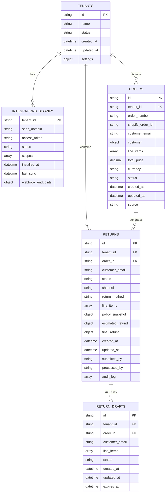
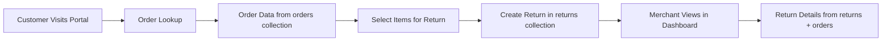
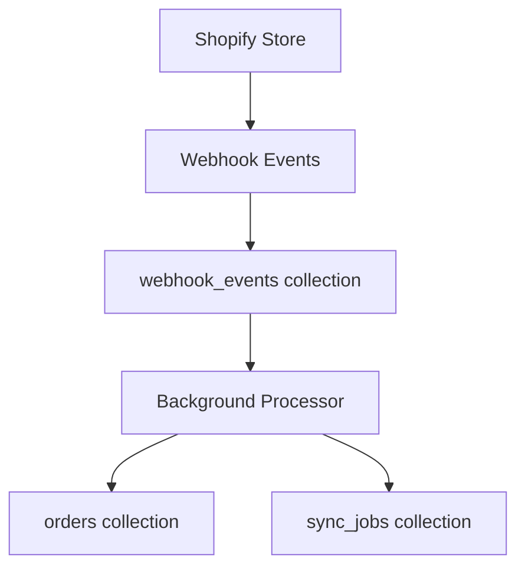

# Data Model & Database Schema

*Last updated: 2025-01-11*

## Database Overview

**Database**: `returns_management` (MongoDB)  
**Multi-tenancy**: All collections include `tenant_id` field for strict isolation

## Collections Schema

### Core Collections



## Collection Details

### `tenants`
Primary tenant configuration and metadata.

```javascript
{
  "_id": ObjectId("..."),
  "id": "tenant-rms34",
  "name": "RMS Demo Store",
  "status": "active",
  "created_at": ISODate("2025-01-10T10:00:00Z"),
  "updated_at": ISODate("2025-01-10T10:00:00Z"),
  "settings": {
    "return_window_days": 30,
    "auto_approve_limit": 100,
    "email_notifications": true
  }
}
```

**Indexes:**
- `{id: 1}` (unique)
- `{status: 1, created_at: -1}`

### `integrations_shopify`
Shopify integration data per tenant.

```javascript
{
  "_id": ObjectId("..."),
  "tenant_id": "tenant-rms34",
  "shop_domain": "rms34.myshopify.com",
  "access_token": "gAAAAABhk...", // Encrypted
  "status": "connected",
  "scopes": [
    "read_orders",
    "read_products", 
    "read_customers",
    "read_fulfillments"
  ],
  "installed_at": ISODate("2025-01-10T10:30:00Z"),
  "last_sync": ISODate("2025-01-11T09:15:22Z"),
  "webhook_endpoints": [
    {
      "topic": "orders/create",
      "endpoint": "https://app.example.com/api/webhooks/orders/create",
      "status": "active"
    }
  ],
  "api_version": "2024-10"
}
```

**Indexes:**
- `{tenant_id: 1}` (unique)
- `{shop_domain: 1}`
- `{status: 1, last_sync: -1}`

### `orders`
Order data from Shopify (cached locally).

```javascript
{
  "_id": ObjectId("..."),
  "id": "5813364687033",
  "tenant_id": "tenant-rms34",
  "order_number": "1001",
  "shopify_order_id": "5813364687033",
  "customer_email": "shashankshekharofficial15@gmail.com",
  "customer": {
    "first_name": "Shashank",
    "last_name": "Shekhar",
    "email": "shashankshekharofficial15@gmail.com"
  },
  "line_items": [
    {
      "id": "13851721105593",
      "title": "TESTORDER",
      "variant_title": null,
      "quantity": 1,
      "price": "400.00",
      "sku": "N/A",
      "product_id": "8553062793401",
      "variant_id": "46218896302393"
    }
  ],
  "total_price": "400.00",
  "currency": "USD",
  "status": "fulfilled",
  "fulfillment_status": "fulfilled",
  "created_at": ISODate("2025-08-10T12:43:24Z"),
  "updated_at": ISODate("2025-08-10T12:43:24Z"),
  "source": "shopify_sync"
}
```

**Indexes:**
- `{id: 1, tenant_id: 1}` (compound unique)
- `{tenant_id: 1, order_number: 1}`
- `{tenant_id: 1, customer_email: 1}`
- `{tenant_id: 1, created_at: -1}`
- `{shopify_order_id: 1}`

### `returns`
Return requests from customers (Elite-Grade system).

```javascript
{
  "_id": ObjectId("..."),
  "id": "ed2af19e-9626-4389-ad79-2ab509cebe67",
  "tenant_id": "tenant-rms34",
  "order_id": "5813364687033",
  "customer_email": "shashankshekharofficial15@gmail.com",
  "status": "requested",
  "channel": "customer",
  "return_method": "customer_ships",
  "line_items": [
    {
      "line_item_id": "13851721105593",
      "title": "TESTORDER",
      "variant_title": null,
      "quantity": 1,
      "unit_price": {
        "amount": 400.00,
        "currency": "USD"
      },
      "sku": "N/A",
      "reason": {
        "code": "defective",
        "description": "Defective"
      },
      "condition": "damaged",
      "photos": []
    }
  ],
  "policy_snapshot": {
    "return_window_days": 30,
    "restocking_fee": 0.15,
    "shipping_cost": 0
  },
  "estimated_refund": {
    "amount": 354.01,
    "currency": "USD"
  },
  "final_refund": null,
  "created_at": ISODate("2025-08-11T10:30:38.017Z"),
  "updated_at": ISODate("2025-08-11T10:30:38.017Z"),
  "submitted_by": "customer",
  "processed_by": null,
  "audit_log": [
    {
      "action": "created",
      "timestamp": ISODate("2025-08-11T10:30:38.017Z"),
      "user": "customer",
      "details": "Return request submitted"
    }
  ]
}
```

**Indexes:**
- `{id: 1, tenant_id: 1}` (compound unique)
- `{tenant_id: 1, status: 1}`
- `{tenant_id: 1, created_at: -1}`
- `{tenant_id: 1, customer_email: 1}`
- `{order_id: 1, tenant_id: 1}`

### `return_drafts`
Temporary return drafts (incomplete submissions).

```javascript
{
  "_id": ObjectId("..."),
  "id": "draft_123",
  "tenant_id": "tenant-rms34",
  "order_id": "5813364687033",
  "customer_email": "customer@example.com",
  "line_items": [
    {
      "line_item_id": "13851721105593",
      "quantity": 1,
      "reason": "defective"
    }
  ],
  "status": "draft",
  "created_at": ISODate("2025-08-11T10:25:00Z"),
  "updated_at": ISODate("2025-08-11T10:27:15Z"),
  "expires_at": ISODate("2025-08-11T22:25:00Z") // 12 hours
}
```

**Indexes:**
- `{id: 1, tenant_id: 1}` (compound unique)
- `{expires_at: 1}` (TTL index for cleanup)
- `{tenant_id: 1, customer_email: 1}`

## Supporting Collections

### `policies`
Return policy configurations per tenant.

```javascript
{
  "_id": ObjectId("..."),
  "tenant_id": "tenant-rms34",
  "name": "Standard Return Policy",
  "rules": [
    {
      "condition": {"days_since_purchase": {"$lte": 30}},
      "action": {"eligible": true, "restocking_fee": 0}
    },
    {
      "condition": {"product_type": "electronics"},
      "action": {"eligible": true, "restocking_fee": 0.15}
    }
  ],
  "default_action": {"eligible": false},
  "active": true,
  "created_at": ISODate("2025-01-10T10:00:00Z")
}
```

### `webhook_events`
Incoming webhook event log.

```javascript
{
  "_id": ObjectId("..."),
  "tenant_id": "tenant-rms34",
  "topic": "orders/create",
  "shop_domain": "rms34.myshopify.com",
  "webhook_id": "webhook_123",
  "payload": {
    "id": 5813364687033,
    "order_number": "1001",
    // ... full Shopify order payload
  },
  "processed": true,
  "processed_at": ISODate("2025-08-11T10:30:00Z"),
  "created_at": ISODate("2025-08-11T10:29:45Z"),
  "hmac_verified": true
}
```

**Indexes:**
- `{tenant_id: 1, created_at: -1}`
- `{topic: 1, processed: 1}`
- `{webhook_id: 1}`

### `sync_jobs`
Background synchronization job tracking.

```javascript
{
  "_id": ObjectId("..."),
  "job_id": "sync_job_123",
  "tenant_id": "tenant-rms34",
  "type": "full_sync",
  "status": "completed",
  "progress": {
    "total_orders": 150,
    "processed_orders": 150,
    "failed_orders": 0
  },
  "started_at": ISODate("2025-01-11T09:00:00Z"),
  "completed_at": ISODate("2025-01-11T09:15:22Z"),
  "error_details": null,
  "config": {
    "days_back": 90,
    "include_fulfillments": true
  }
}
```

**Indexes:**
- `{tenant_id: 1, created_at: -1}`
- `{status: 1, started_at: -1}`
- `{job_id: 1}` (unique)

## Index Strategy

### Performance Indexes
```javascript
// High-frequency queries
db.returns.createIndex({tenant_id: 1, status: 1, created_at: -1});
db.orders.createIndex({tenant_id: 1, order_number: 1});
db.integrations_shopify.createIndex({tenant_id: 1}); // unique

// Search functionality  
db.returns.createIndex({tenant_id: 1, customer_email: 1});
db.orders.createIndex({tenant_id: 1, customer_email: 1});

// Foreign key relationships
db.returns.createIndex({order_id: 1, tenant_id: 1});

// Background cleanup
db.return_drafts.createIndex({expires_at: 1}, {expireAfterSeconds: 0});
```

### Query Patterns
```javascript
// Most common queries and their indexes

// 1. List returns for merchant dashboard
db.returns.find({
  tenant_id: "tenant-rms34",
  status: {$in: ["requested", "approved"]}
}).sort({created_at: -1}).limit(20);
// Uses: {tenant_id: 1, status: 1, created_at: -1}

// 2. Customer order lookup
db.orders.findOne({
  tenant_id: "tenant-rms34", 
  order_number: "1001",
  customer_email: "customer@example.com"
});
// Uses: {tenant_id: 1, order_number: 1}

// 3. Return details with order info
db.returns.findOne({id: "return_123", tenant_id: "tenant-rms34"});
db.orders.findOne({id: "order_456", tenant_id: "tenant-rms34"});
// Uses: {id: 1, tenant_id: 1} on both collections

// 4. Shopify integration status
db.integrations_shopify.findOne({tenant_id: "tenant-rms34"});
// Uses: {tenant_id: 1} (unique)
```

## Data Relationships

### Customer Journey Data Flow


### Shopify Sync Flow


## Data Lifecycle

### Retention Policies
- **return_drafts**: Auto-expire after 12 hours (TTL index)
- **webhook_events**: Keep 90 days for debugging
- **sync_jobs**: Keep 30 days of job history
- **audit_log**: Permanent retention for compliance

### Cleanup Procedures
```javascript
// Monthly cleanup script
// Remove old webhook events
db.webhook_events.deleteMany({
  created_at: {$lt: new Date(Date.now() - 90*24*60*60*1000)}
});

// Remove old sync jobs  
db.sync_jobs.deleteMany({
  created_at: {$lt: new Date(Date.now() - 30*24*60*60*1000)},
  status: {$in: ["completed", "failed"]}
});
```

## Sample Queries

### Customer Portal Queries
```javascript
// Order lookup for return
db.orders.findOne({
  tenant_id: "tenant-rms34",
  order_number: "1001", 
  "customer.email": "customer@example.com"
});

// Check existing returns for order
db.returns.find({
  tenant_id: "tenant-rms34",
  order_id: "5813364687033"
});
```

### Merchant Dashboard Queries
```javascript
// Returns list with pagination and filters
db.returns.find({
  tenant_id: "tenant-rms34",
  status: "requested",
  customer_email: /shashank/i
}).sort({created_at: -1}).skip(0).limit(10);

// Return details with aggregation
db.returns.aggregate([
  {$match: {id: "return_123", tenant_id: "tenant-rms34"}},
  {$lookup: {
    from: "orders",
    localField: "order_id", 
    foreignField: "id",
    as: "order_details"
  }}
]);
```

### Analytics Queries
```javascript
// Returns by status for dashboard
db.returns.aggregate([
  {$match: {tenant_id: "tenant-rms34"}},
  {$group: {_id: "$status", count: {$sum: 1}}},
  {$sort: {count: -1}}
]);

// Daily return trends
db.returns.aggregate([
  {$match: {
    tenant_id: "tenant-rms34",
    created_at: {$gte: new Date("2025-01-01")}
  }},
  {$group: {
    _id: {$dateToString: {format: "%Y-%m-%d", date: "$created_at"}},
    count: {$sum: 1},
    total_amount: {$sum: "$estimated_refund.amount"}
  }},
  {$sort: {_id: 1}}
]);
```

---

**Next**: See [SHOPIFY_INTEGRATION.md](./SHOPIFY_INTEGRATION.md) for OAuth and API details.