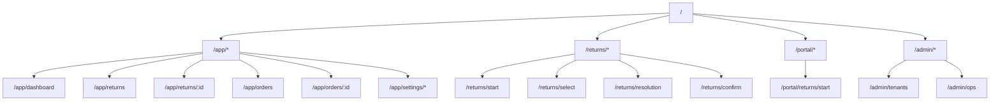
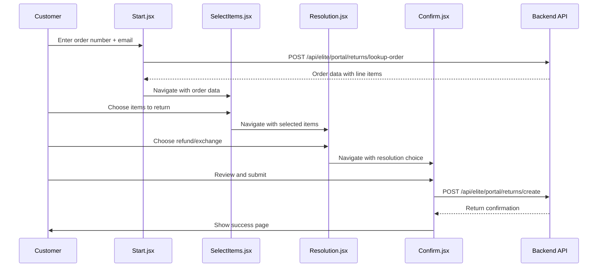
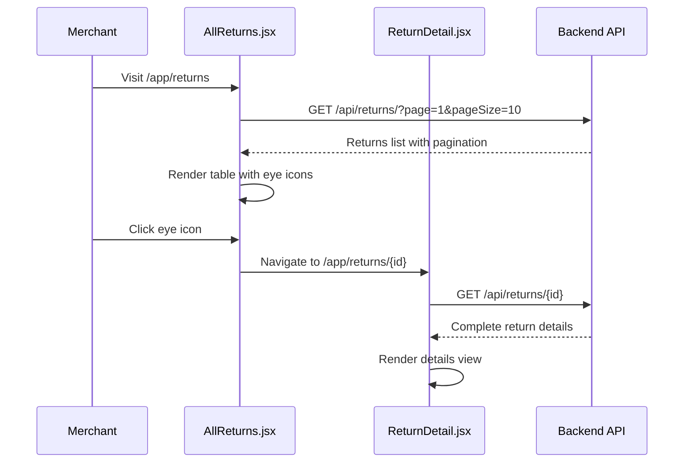
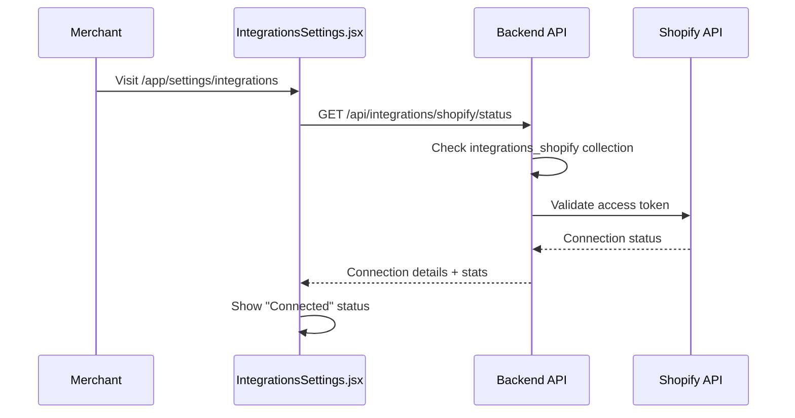

# Frontend Route & Component Mapping

*Last updated: 2025-01-11*

## Route Structure Overview



## Complete Route → Component → API Mapping

### Customer Return Portal Routes

| Route | Component | File | APIs Called | Description |
|-------|-----------|------|-------------|-------------|
| `/returns` | `Navigate to /returns/start` | `App.jsx:76` | None | Redirect to start |
| `/returns/start` | `CustomerStart` | `pages/customer/Start.jsx` | `POST /api/elite/portal/returns/lookup-order` | Order lookup form |
| `/returns/select` | `CustomerSelectItems` | `pages/customer/SelectItems.jsx` | None | Item selection from order |
| `/returns/resolution` | `CustomerResolution` | `pages/customer/Resolution.jsx` | None | Choose refund/exchange |
| `/returns/confirm` | `CustomerConfirm` | `pages/customer/Confirm.jsx` | `POST /api/elite/portal/returns/create` | Final submission |
| `/returns/status/:returnId` | `CustomerStatus` | `pages/customer/StatusTracker.jsx` | `GET /api/elite/portal/returns/status/{returnId}` | Track return status |

### Merchant Dashboard Routes

| Route | Component | File | APIs Called | Description |
|-------|-----------|------|-------------|-------------|
| `/app` | `Navigate to /app/dashboard` | `App.jsx:104` | None | Redirect to dashboard |
| `/app/dashboard` | `Dashboard` | `pages/merchant/Dashboard.js` | `GET /api/analytics`, `GET /api/returns/` | Overview metrics |
| `/app/returns` | `AllReturns` | `pages/merchant/returns/AllReturns.jsx` | `GET /api/returns/` | Returns list with filters |
| `/app/returns/create` | `CreateReturnMerchant` | `pages/merchant/returns/CreateReturn.jsx` | `POST /api/elite/admin/returns/` | Manual return creation |
| `/app/returns/:id` | `ReturnDetail` | `pages/merchant/returns/ReturnDetail.jsx` | `GET /api/returns/{id}`, `GET /api/returns/{id}/timeline` | Return details view |
| `/app/orders` | `Orders` | `pages/merchant/Orders.jsx` | `GET /api/orders/` | Orders list |
| `/app/orders/:orderId` | `OrderDetail` | `pages/merchant/OrderDetail.jsx` | `GET /api/orders/{orderId}` | Order details |
| `/app/rules` | `Rules` | `pages/merchant/Rules.jsx` | `GET /api/rules/`, `POST /api/rules/` | Return rules config |
| `/app/analytics` | `Analytics` | `pages/merchant/Analytics.jsx` | `GET /api/analytics/returns`, `GET /api/analytics/trends` | Reports & charts |
| `/app/settings/integrations` | `IntegrationsSettings` | `pages/merchant/settings/IntegrationsSettings.jsx` | `GET /api/integrations/shopify/status` | Shopify connection |

### Admin Routes

| Route | Component | File | APIs Called | Description |
|-------|-----------|------|-------------|-------------|
| `/admin/tenants` | `AdminTenants` | `pages/admin/Tenants.jsx` | `GET /api/admin/tenants/` | Tenant management |
| `/admin/ops` | `AdminOperations` | `pages/admin/Operations.jsx` | `GET /api/admin/operations/` | System operations |

## Data Flow Diagrams

### Customer Return Creation Flow



### Merchant Returns Dashboard Flow



### Integration Status Flow



## Component Architecture

### Customer Portal Components

```
pages/customer/
├── Start.jsx                 # Order lookup form
│   ├── Uses: OrderLookupForm component
│   ├── State: order, loading, error
│   ├── API: /api/elite/portal/returns/lookup-order
│   └── Navigation: → SelectItems on success
├── SelectItems.jsx           # Item selection grid
│   ├── Props: order (from navigation state)
│   ├── State: selectedItems map
│   └── Navigation: → Resolution with selections
├── Resolution.jsx            # Refund/exchange choice
│   ├── Props: order, selectedItems
│   ├── State: resolutionType (refund/exchange)
│   └── Navigation: → Confirm with resolution
└── Confirm.jsx              # Final review & submit
    ├── Props: order, selectedItems, resolution
    ├── API: /api/elite/portal/returns/create
    └── Navigation: → Success page
```

### Merchant Dashboard Components

```
pages/merchant/
├── returns/
│   ├── AllReturns.jsx        # Main returns list
│   │   ├── State: returns[], pagination, filters
│   │   ├── API: /api/returns/ with query params
│   │   └── Features: Search, filter, pagination
│   └── ReturnDetail.jsx      # Individual return view
│       ├── State: returnRequest, timeline, loading
│       ├── APIs: /api/returns/{id}, /api/returns/{id}/timeline
│       └── Features: Approve/deny, timeline, item details
├── Orders.jsx               # Orders list
│   ├── State: orders[], pagination, search
│   ├── API: /api/orders/ with filters
│   └── Features: Search by order number, customer
└── OrderDetail.jsx          # Individual order view
    ├── State: order, relatedReturns
    ├── API: /api/orders/{id}
    └── Features: Order info, related returns
```

## State Management Patterns

### Customer Portal State Flow
```javascript
// Start.jsx
const [order, setOrder] = useState(null);
// Navigation passes order via state
navigate('/returns/select', { state: { order } });

// SelectItems.jsx  
const { state } = useLocation();
const order = state?.order;
const [selectedItems, setSelectedItems] = useState({});
// Pass via navigation state

// Resolution.jsx
const { state } = useLocation();
const { order, selectedItems } = state;
const [resolutionType, setResolutionType] = useState('refund');

// Confirm.jsx - combines all state for API call
const { state } = useLocation();
const { order, selectedItems, resolutionType } = state;
```

### Merchant Dashboard State Flow
```javascript
// AllReturns.jsx
const [returns, setReturns] = useState([]);
const [pagination, setPagination] = useState({});
const [filters, setFilters] = useState({ search: '', status: '' });

// API call with debounced search
useEffect(() => {
  loadReturns();
}, [filters, pagination.page]);

// ReturnDetail.jsx - URL param for ID
const { id } = useParams();
const [returnRequest, setReturnRequest] = useState(null);
```

## API Integration Patterns

### Tenant Header Injection
All API calls include tenant header:
```javascript
// Common pattern in all components
const tenantId = 'tenant-rms34'; // Configured per component
const headers = {
  'Content-Type': 'application/json',
  'X-Tenant-Id': tenantId
};
```

### Error Handling Pattern
```javascript
try {
  const response = await fetch(apiUrl, { headers });
  if (response.ok) {
    const data = await response.json();
    // Handle success
  } else {
    // Handle HTTP errors
    setError('Failed to load data');
  }
} catch (err) {
  // Handle network errors
  setError('Network error occurred');
}
```

### Loading States
```javascript
const [loading, setLoading] = useState(false);
const [error, setError] = useState('');

const loadData = async () => {
  setLoading(true);
  setError('');
  try {
    // API call
  } catch (err) {
    setError(err.message);
  } finally {
    setLoading(false);
  }
};
```

## Adding New Pages - Recipe

### 1. Create Component File
```javascript
// pages/merchant/NewPage.jsx
import React, { useState, useEffect } from 'react';

const NewPage = () => {
  const [data, setData] = useState([]);
  const [loading, setLoading] = useState(false);
  const tenantId = 'tenant-rms34';

  const loadData = async () => {
    setLoading(true);
    try {
      const response = await fetch('/api/new-endpoint/', {
        headers: {
          'Content-Type': 'application/json',
          'X-Tenant-Id': tenantId
        }
      });
      if (response.ok) {
        const result = await response.json();
        setData(result.data);
      }
    } catch (err) {
      console.error('Load error:', err);
    } finally {
      setLoading(false);
    }
  };

  useEffect(() => {
    loadData();
  }, []);

  return (
    <div>
      <h1>New Page</h1>
      {loading ? <p>Loading...</p> : null}
      {/* Render data */}
    </div>
  );
};

export default NewPage;
```

### 2. Add Route to App.jsx
```javascript
// App.jsx - add to merchant routes
<Route path="new-page" element={<NewPage />} />
```

### 3. Add Navigation Link
```javascript
// Update sidebar navigation component
<NavLink to="/app/new-page">New Page</NavLink>
```

### 4. Create Backend API (if needed)
```python
# controllers/new_controller.py
@router.get("/")
async def get_new_data(tenant_id: str = Depends(get_tenant_id)):
    # Implementation
    return {"data": [...]}
```

---

**Next**: See [DATA_MODEL.md](./DATA_MODEL.md) for database schema details.