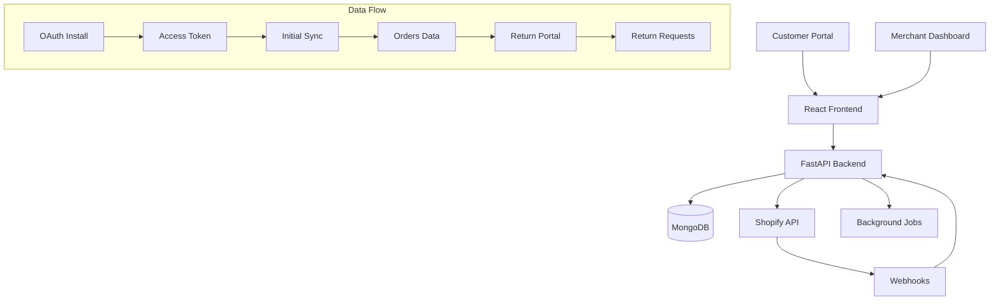

# Returns Management SaaS - Developer Documentation

*Last updated: 2025-01-11*

## 🚀 Quick Start (5 minutes)

### Local Development
```bash
# Clone and setup
cd /app

# Backend
cd backend
pip install -r requirements.txt
python server.py

# Frontend (new terminal)
cd frontend
yarn install
yarn start

# Open http://localhost:3000
```

### On Emergent Platform
```bash
# Already configured - just access your preview URL
# Frontend: https://shopify-sync-fix.preview.emergentagent.com
# Backend: https://shopify-sync-fix.preview.emergentagent.com/api
```

## 📖 Table of Contents

| Document | Description |
|----------|-------------|
| [**ARCHITECTURE.md**](./ARCHITECTURE.md) | Hexagonal + CQRS design, sequence diagrams |
| [**API.md**](./API.md) | Complete endpoint catalog with examples |
| [**FRONTEND_MAP.md**](./FRONTEND_MAP.md) | UI routes → components → API mappings |
| [**DATA_MODEL.md**](./DATA_MODEL.md) | MongoDB collections, schemas, ERDs |
| [**SHOPIFY_INTEGRATION.md**](./SHOPIFY_INTEGRATION.md) | OAuth, webhooks, GraphQL sync |
| [**RETURNS_PORTAL.md**](./RETURNS_PORTAL.md) | Customer flow, policies, offers |
| [**RUNBOOK.md**](./RUNBOOK.md) | On-call fixes & emergency procedures |
| [**TROUBLESHOOTING.md**](./TROUBLESHOOTING.md) | Common errors and solutions |
| [**OBSERVABILITY.md**](./OBSERVABILITY.md) | Logs, metrics, health checks |
| [**SECURITY.md**](./SECURITY.md) | Secrets, tenant isolation, PII |
| [**CONTRIBUTING.md**](./CONTRIBUTING.md) | Development workflow, PR process |
| [**CHANGELOG.md**](./CHANGELOG.md) | Version history and changes |

## 🗺️ System Overview



## 📁 Repository Structure

```
/app/
├── backend/                     # FastAPI application
│   ├── server.py               # Main FastAPI app entry point
│   ├── src/
│   │   ├── controllers/        # HTTP route handlers
│   │   │   ├── elite_portal_returns_controller.py
│   │   │   ├── returns_controller_enhanced.py
│   │   │   └── shopify_integration_controller.py
│   │   ├── services/           # Business logic layer
│   │   │   ├── shopify_service.py
│   │   │   └── sync_service.py
│   │   ├── domain/             # Hexagonal Architecture - Domain
│   │   │   ├── entities/
│   │   │   ├── services/
│   │   │   └── ports/
│   │   ├── application/        # CQRS Commands & Queries
│   │   │   ├── commands.py
│   │   │   ├── queries.py
│   │   │   └── handlers/
│   │   └── infrastructure/     # External adapters
│   │       ├── repositories/
│   │       └── services/
├── frontend/                   # React application
│   ├── src/
│   │   ├── pages/
│   │   │   ├── customer/       # Return portal UI
│   │   │   ├── merchant/       # Dashboard UI
│   │   │   └── admin/          # Super admin UI
│   │   └── components/
│   └── public/
├── docs/                       # This documentation
└── scripts/                    # Automation & validation
```

## 🔧 Common Commands

### Development
```bash
# Start services
sudo supervisorctl restart all
sudo supervisorctl status

# Check logs
tail -f /var/log/supervisor/backend.err.log
tail -f /var/log/supervisor/frontend.err.log

# Validate documentation
make docs:check
# or
npm run docs:check
```

### Configuration Hot Spots
```bash
# Shopify app settings
vi backend/.env
# SHOPIFY_API_KEY, SHOPIFY_API_SECRET, APP_URL

# Tenant configuration
# Default tenant: tenant-rms34
# Shopify store: rms34.myshopify.com

# Database
# Collection: returns_management
# Main collections: returns, orders, integrations_shopify
```

## 🎯 Mental Model

**Data flows in this order:**
1. **Shopify OAuth** → Access token stored in `integrations_shopify`
2. **Initial Sync** → Orders stored in `orders` collection
3. **Customer Portal** → Real-time Shopify lookup + return creation
4. **Return Storage** → Saved to `returns` collection
5. **Merchant Dashboard** → Displays returns with live Shopify data

**Key tenant isolation:**
- Every API call requires `X-Tenant-Id` header
- All database queries filtered by `tenant_id`
- Frontend hardcoded to `tenant-rms34` (configured in components)

## 🚨 Critical Paths to Test

1. **OAuth Setup**: `/api/auth/shopify/install` → callback → token storage
2. **Order Lookup**: Customer portal → Shopify GraphQL → order display
3. **Return Creation**: Portal form → API → database → merchant view
4. **Return Details**: Merchant clicks eye icon → detailed view loads

## 📊 Health Checks

```bash
# Backend health
curl https://your-url.com/api/health

# Shopify integration status
curl -H "X-Tenant-Id: tenant-rms34" https://your-url.com/api/integrations/shopify/status

# Database connectivity
curl -H "X-Tenant-Id: tenant-rms34" https://your-url.com/api/returns/
```

---

**Next Steps**: Start with [ARCHITECTURE.md](./ARCHITECTURE.md) for system design, then [API.md](./API.md) for endpoint details.