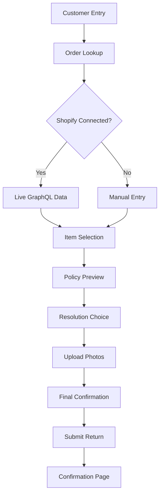
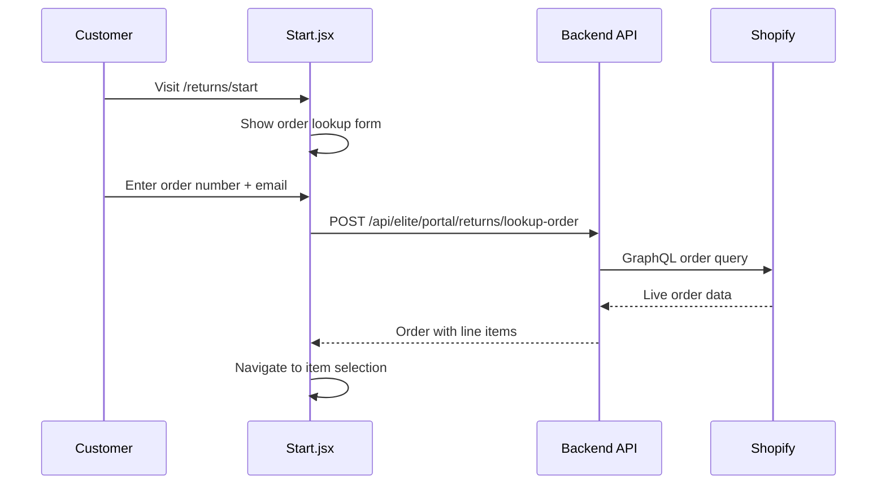
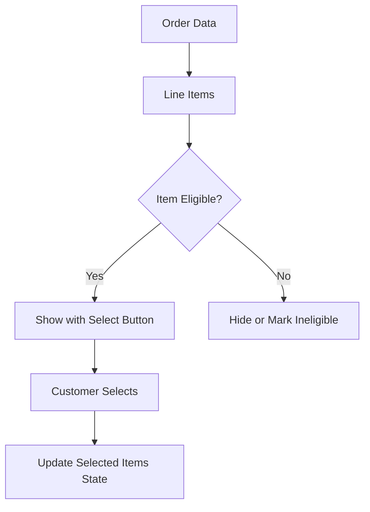
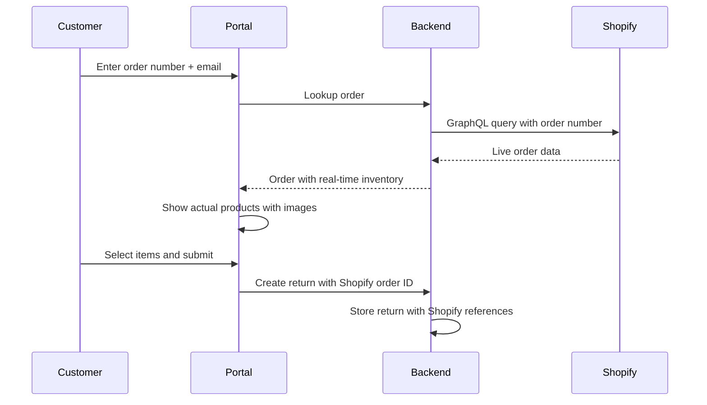
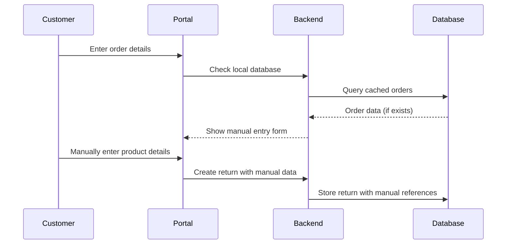
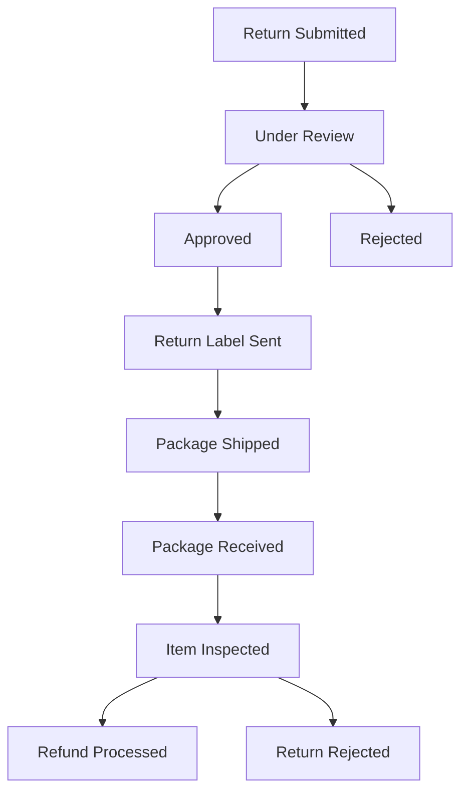

# Customer Returns Portal Guide

*Last updated: 2025-01-11*

## Portal Overview

The customer returns portal provides an 8-step unified form that supports both Shopify-connected lookup and fallback modes. Customers can initiate returns without merchant accounts.

## Portal Architecture



## User Flow Steps

### Step 1: Customer Entry (`/returns/start`)

**Component:** `pages/customer/Start.jsx`  
**Purpose:** Initial landing page with order lookup form



**Form Fields:**
- `order_number`: Order number (e.g., "1001")
- `customer_email`: Email address for validation
- Optional: `zip_code` for additional verification

**API Integration:**
```javascript
const lookupOrder = async (orderNumber, email) => {
  const response = await fetch('/api/elite/portal/returns/lookup-order', {
    method: 'POST',
    headers: {
      'Content-Type': 'application/json',
      'X-Tenant-Id': 'tenant-rms34'
    },
    body: JSON.stringify({
      order_number: orderNumber,
      customer_email: email
    })
  });
  
  const result = await response.json();
  if (result.success) {
    // Navigate to item selection with order data
    navigate('/returns/select', { state: { order: result.order } });
  } else {
    setError(result.message);
  }
};
```

### Step 2: Item Selection (`/returns/select`)

**Component:** `pages/customer/SelectItems.jsx`  
**Purpose:** Display eligible items and allow selection



**Eligibility Rules:**
- Within return window (default 30 days)
- Item fulfilled and shipped
- Not already returned
- Not restricted product type

**UI Components:**
```jsx
const SelectItems = () => {
  const { state } = useLocation();
  const order = state?.order;
  const [selectedItems, setSelectedItems] = useState({});

  const toggleItemSelection = (lineItemId) => {
    setSelectedItems(prev => ({
      ...prev,
      [lineItemId]: !prev[lineItemId]
    }));
  };

  return (
    <div className="item-selection">
      {order.line_items.map(item => (
        <ItemCard 
          key={item.id}
          item={item}
          selected={selectedItems[item.id]}
          onToggle={() => toggleItemSelection(item.id)}
        />
      ))}
      <ContinueButton 
        disabled={!Object.values(selectedItems).some(Boolean)}
        onClick={() => navigate('/returns/resolution', { 
          state: { order, selectedItems } 
        })}
      />
    </div>
  );
};
```

### Step 3: Resolution Choice (`/returns/resolution`)

**Component:** `pages/customer/Resolution.jsx`  
**Purpose:** Select desired outcome (refund, exchange, store credit)

**Resolution Options:**
- **Refund**: Money back to original payment method
- **Store Credit**: Credit for future purchases  
- **Exchange**: Replace with same or different item
- **Replacement**: Same item, no charge (for defects)

```jsx
const Resolution = () => {
  const { state } = useLocation();
  const { order, selectedItems } = state;
  const [resolutionType, setResolutionType] = useState('refund');

  const resolutionOptions = [
    { id: 'refund', label: 'Refund to original payment', icon: '💳' },
    { id: 'store_credit', label: 'Store credit', icon: '🎫' },
    { id: 'exchange', label: 'Exchange for different item', icon: '🔄' },
    { id: 'replacement', label: 'Replacement (same item)', icon: '📦' }
  ];

  return (
    <div className="resolution-selection">
      {resolutionOptions.map(option => (
        <ResolutionCard
          key={option.id}
          option={option}
          selected={resolutionType === option.id}
          onSelect={() => setResolutionType(option.id)}
        />
      ))}
    </div>
  );
};
```

### Step 4: Policy Preview (`/returns/policy`)

**Component:** Integrated into resolution step  
**API:** `POST /api/elite/portal/returns/policy-preview`

**Purpose:** Show calculated fees, refund amounts, and policy terms

```javascript
const previewPolicy = async (orderData, selectedItems, resolutionType) => {
  const response = await fetch('/api/elite/portal/returns/policy-preview', {
    method: 'POST',
    headers: {
      'Content-Type': 'application/json',
      'X-Tenant-Id': 'tenant-rms34'
    },
    body: JSON.stringify({
      order_id: orderData.id,
      items: selectedItems,
      resolution_type: resolutionType
    })
  });

  return await response.json();
};

// Response format:
{
  "eligible": true,
  "policy": {
    "return_window_days": 30,
    "restocking_fee_percent": 15,
    "shipping_cost": 0
  },
  "estimated_refund": {
    "subtotal": 400.00,
    "restocking_fee": -60.00,
    "shipping": 0.00,
    "total": 340.00,
    "currency": "USD"
  },
  "requirements": [
    "Items must be in original condition",
    "Original packaging required",
    "Return within 30 days of delivery"
  ]
}
```

### Step 5: Return Reasons & Conditions

**Component:** Part of item selection  
**Purpose:** Collect return reasons for each item

**Reason Categories:**
- **Defective/Damaged**: Item arrived broken or faulty
- **Wrong Item**: Received different item than ordered
- **Size/Fit**: Clothing size or fit issues
- **Not as Described**: Item doesn't match description
- **Changed Mind**: Customer no longer wants item

**Condition Assessment:**
- **New**: Unused, original tags/packaging
- **Like New**: Minimal use, no damage
- **Good**: Light wear, functional
- **Fair**: Noticeable wear but functional
- **Poor**: Significant damage

```jsx
const ReasonSelector = ({ item, onReasonChange }) => {
  const [reason, setReason] = useState('');
  const [condition, setCondition] = useState('');
  const [details, setDetails] = useState('');

  const reasons = [
    { id: 'defective', label: 'Defective/Damaged' },
    { id: 'wrong_item', label: 'Wrong Item Received' },
    { id: 'size_fit', label: 'Size/Fit Issue' },
    { id: 'not_described', label: 'Not as Described' },
    { id: 'changed_mind', label: 'Changed Mind' }
  ];

  return (
    <div className="reason-selector">
      <Select value={reason} onChange={setReason}>
        {reasons.map(r => (
          <option key={r.id} value={r.id}>{r.label}</option>
        ))}
      </Select>
      <ConditionSelector value={condition} onChange={setCondition} />
      <textarea 
        placeholder="Additional details (optional)"
        value={details}
        onChange={e => setDetails(e.target.value)}
      />
    </div>
  );
};
```

### Step 6: Photo Upload (Optional)

**Component:** `PhotoUpload` component  
**API:** `POST /api/elite/portal/returns/upload-photo`

**Purpose:** Allow customers to upload photos of damaged items

```javascript
const PhotoUpload = ({ returnId, lineItemId, onPhotoUploaded }) => {
  const uploadPhoto = async (file) => {
    const formData = new FormData();
    formData.append('file', file);
    formData.append('return_id', returnId);
    formData.append('line_item_id', lineItemId);

    const response = await fetch('/api/elite/portal/returns/upload-photo', {
      method: 'POST',
      headers: {
        'X-Tenant-Id': 'tenant-rms34'
      },
      body: formData
    });

    if (response.ok) {
      const result = await response.json();
      onPhotoUploaded(result.photo_url);
    }
  };

  return (
    <div className="photo-upload">
      <input 
        type="file" 
        accept="image/*"
        onChange={e => uploadPhoto(e.target.files[0])}
      />
      <p>Upload photos to help us process your return faster</p>
    </div>
  );
};
```

### Step 7: Final Confirmation (`/returns/confirm`)

**Component:** `pages/customer/Confirm.jsx`  
**Purpose:** Review all details and submit return request

**Display Summary:**
- Order details
- Selected items with reasons
- Resolution type
- Estimated refund/credit amount
- Return policy terms

```jsx
const Confirm = () => {
  const { state } = useLocation();
  const { order, selectedItems, resolutionType, policyPreview } = state;

  const submitReturn = async () => {
    const returnData = {
      order_id: order.id,
      customer_email: order.customer.email,
      return_method: 'customer_ships',
      items: Object.entries(selectedItems)
        .filter(([_, selected]) => selected)
        .map(([lineItemId, _]) => {
          const item = order.line_items.find(i => i.id === lineItemId);
          return {
            line_item_id: lineItemId,
            quantity: 1,
            reason: item.return_reason,
            title: item.title,
            unit_price: item.unit_price,
            sku: item.sku,
            condition: item.condition
          };
        }),
      reason: 'Customer return request',
      resolution_type: resolutionType
    };

    const response = await fetch('/api/elite/portal/returns/create', {
      method: 'POST',
      headers: {
        'Content-Type': 'application/json',
        'X-Tenant-Id': 'tenant-rms34'
      },
      body: JSON.stringify(returnData)
    });

    if (response.ok) {
      const result = await response.json();
      navigate('/returns/confirmation/' + result.return_request.return_id);
    }
  };

  return (
    <div className="confirmation-page">
      <ReturnSummary 
        order={order}
        items={selectedItems}
        resolution={resolutionType}
        refundAmount={policyPreview.estimated_refund}
      />
      <SubmitButton onClick={submitReturn} />
    </div>
  );
};
```

### Step 8: Success Confirmation

**Component:** `pages/customer/ReturnConfirmation.jsx`  
**Purpose:** Show confirmation with tracking information

**Confirmation Details:**
- Return request ID
- Estimated processing time
- Return shipping instructions
- Tracking link
- Next steps

## Dual Mode Operation

### Shopify-Connected Mode

When Shopify integration is active:



**Benefits:**
- Real-time order data
- Product images and details
- Accurate pricing and inventory
- Customer validation via email
- Automatic eligibility checking

### Fallback Mode

When Shopify is disconnected or order not found:



**Fallback Features:**
- Manual product entry
- Generic return reasons
- Basic policy application
- Email confirmation without Shopify references

## Return Policies & Rules Engine

### Policy Configuration

```javascript
// Example policy configuration
{
  "tenant_id": "tenant-rms34",
  "rules": [
    {
      "condition": {
        "days_since_purchase": {"$lte": 30},
        "product_type": {"$ne": "gift_card"}
      },
      "action": {
        "eligible": true,
        "restocking_fee": 0,
        "return_methods": ["customer_ships", "drop_off"]
      }
    },
    {
      "condition": {
        "product_type": "electronics",
        "condition": {"$in": ["new", "like_new"]}
      },
      "action": {
        "eligible": true,
        "restocking_fee": 0.15,
        "inspection_required": true
      }
    }
  ],
  "default_action": {
    "eligible": false,
    "reason": "Outside return window"
  }
}
```

### Policy Evaluation

```python
# services/rules_service.py
def evaluate_return_policy(order, line_items, resolution_type):
    """Evaluate return policy for given items"""
    
    for item in line_items:
        # Calculate days since purchase
        days_since = (datetime.now() - order.created_at).days
        
        # Apply rules in order
        for rule in tenant_policy.rules:
            if evaluate_condition(rule.condition, {
                'days_since_purchase': days_since,
                'product_type': item.product_type,
                'order_total': order.total_price,
                'customer_tier': order.customer.tier
            }):
                return rule.action
        
        # No rules matched, apply default
        return tenant_policy.default_action
```

## Offers & Promotions

### Dynamic Offer System

```javascript
// Example offer during return process
{
  "type": "retention_offer",
  "trigger": "high_value_return",
  "offer": {
    "type": "discount_coupon",
    "value": 20,
    "unit": "percent",
    "code": "STAY20",
    "message": "We're sorry this didn't work out! Here's 20% off your next order.",
    "expiry": "2025-02-11T00:00:00Z"
  },
  "conditions": {
    "min_return_value": 100,
    "customer_segment": "high_value",
    "max_uses_per_customer": 1
  }
}
```

### Offer Presentation

```jsx
const RetentionOffer = ({ offer, onAccept, onDecline }) => {
  return (
    <div className="retention-offer">
      <h3>Wait! We have something for you</h3>
      <p>{offer.message}</p>
      <div className="offer-details">
        <span className="discount">{offer.value}% OFF</span>
        <span className="code">Code: {offer.code}</span>
      </div>
      <div className="offer-actions">
        <button onClick={onAccept}>Accept Offer</button>
        <button onClick={onDecline}>Continue with Return</button>
      </div>
    </div>
  );
};
```

## Notifications & Communication

### Email Notifications

**Return Submitted:**
```html
Subject: Return Request Received - Order #1001

Hi Shashank,

We've received your return request for Order #1001.

Return ID: ed2af19e-9626-4389-ad79-2ab509cebe67
Items: TESTORDER (Qty: 1)
Reason: Defective
Expected Refund: $354.01

What happens next:
1. We'll review your request within 1 business day
2. If approved, you'll receive return shipping instructions
3. Send the item back using our prepaid label
4. Refund processed within 3-5 business days after we receive the item

Track your return: https://app.example.com/returns/status/ed2af19e...

Questions? Reply to this email or contact support.

Thanks,
The RMS Team
```

**SMS Notifications (Optional):**
- Return approved
- Shipping label ready
- Package received
- Refund processed

### Status Tracking

**Customer Status Page:** `/returns/status/:returnId`



## Testing the Portal

### Manual Testing Checklist

1. **Order Lookup**
   - [ ] Valid order number + email works
   - [ ] Invalid order shows appropriate error
   - [ ] Shopify integration status affects flow

2. **Item Selection**
   - [ ] All eligible items displayed
   - [ ] Ineligible items handled correctly
   - [ ] Selection state persists across steps

3. **Policy Preview**
   - [ ] Fees calculated correctly
   - [ ] Policy terms displayed
   - [ ] Different resolution types work

4. **Form Submission**
   - [ ] All required fields validated
   - [ ] API errors handled gracefully
   - [ ] Success confirmation shown

5. **Email Integration**
   - [ ] Confirmation emails sent
   - [ ] Email templates render correctly
   - [ ] Tracking links functional

### Test Data

```javascript
// Test order data for Shopify integration
const testOrder = {
  order_number: "1001",
  customer_email: "shashankshekharofficial15@gmail.com",
  expected_items: [
    {
      title: "TESTORDER",
      price: "400.00",
      sku: "N/A"
    }
  ]
};

// Test different customer scenarios
const testScenarios = [
  {
    name: "Happy path - valid order",
    order: "1001",
    email: "shashankshekharofficial15@gmail.com",
    expected: "success"
  },
  {
    name: "Order not found",
    order: "9999",
    email: "test@example.com", 
    expected: "not_found_error"
  },
  {
    name: "Email mismatch",
    order: "1001",
    email: "wrong@example.com",
    expected: "validation_error"
  }
];
```

---

**Next**: See [RUNBOOK.md](./RUNBOOK.md) for operational procedures.