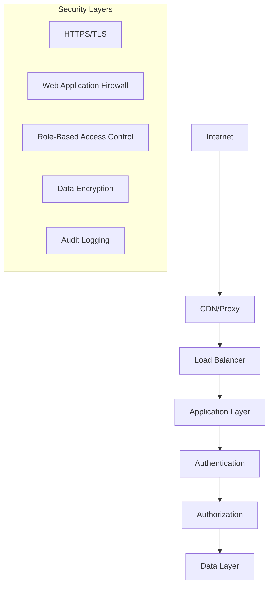
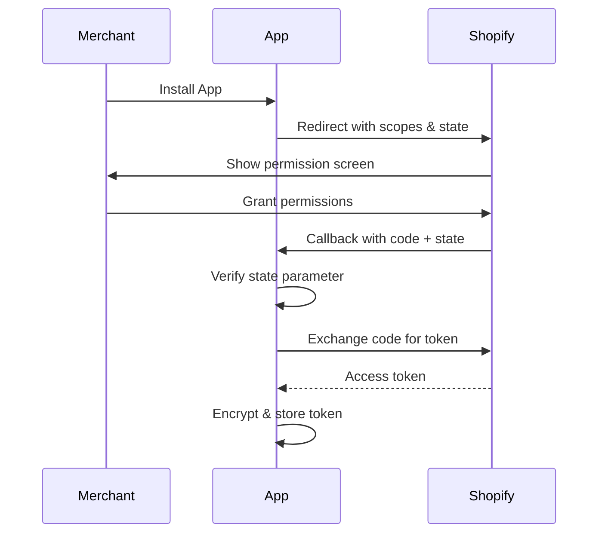

# Security Guide

*Last updated: 2025-01-11*

## Security Architecture

### Defense in Depth



## Authentication & Authorization

### Shopify OAuth Security

**OAuth 2.0 Flow:**


**Security Controls:**
- **State Parameter:** Prevents CSRF attacks during OAuth flow
- **HTTPS Only:** All OAuth URLs must use HTTPS
- **Token Encryption:** Access tokens encrypted at rest using Fernet
- **Scope Validation:** Only request necessary permissions

**Implementation:**
```python
# OAuth state generation & verification
import secrets
import hashlib

def generate_oauth_state() -> str:
    """Generate cryptographically secure state parameter"""
    return secrets.token_urlsafe(32)

def verify_oauth_state(state: str, stored_state: str) -> bool:
    """Constant-time state verification"""
    return secrets.compare_digest(state, stored_state)

# Token encryption
from cryptography.fernet import Fernet

class TokenEncryption:
    def __init__(self, key: bytes):
        self.fernet = Fernet(key)
    
    def encrypt_token(self, token: str) -> str:
        """Encrypt access token for storage"""
        return self.fernet.encrypt(token.encode()).decode()
    
    def decrypt_token(self, encrypted_token: str) -> str:
        """Decrypt stored access token"""
        return self.fernet.decrypt(encrypted_token.encode()).decode()
```

### Multi-Tenant Security

**Tenant Isolation:**
- Every API request requires `X-Tenant-Id` header
- All database queries filtered by `tenant_id`
- No cross-tenant data access possible

**Middleware Implementation:**
```python
# middleware/security.py
async def tenant_validation_middleware(request: Request, call_next):
    """Validate and inject tenant context"""
    
    # Skip validation for public endpoints
    if request.url.path in PUBLIC_PATHS:
        return await call_next(request)
    
    # Extract tenant ID from header
    tenant_id = request.headers.get("X-Tenant-Id")
    if not tenant_id:
        raise HTTPException(401, "X-Tenant-Id header required")
    
    # Validate tenant exists and is active
    tenant = await validate_tenant(tenant_id)
    if not tenant:
        raise HTTPException(403, "Invalid tenant")
    
    # Inject tenant context
    request.state.tenant_id = tenant_id
    return await call_next(request)

async def validate_tenant(tenant_id: str) -> dict:
    """Verify tenant exists and is active"""
    tenant = await db.tenants.find_one({
        "id": tenant_id,
        "status": "active"
    })
    return tenant
```

**Database Query Pattern:**
```python
# Always include tenant_id in queries
async def get_returns(tenant_id: str, status: str = None):
    query = {"tenant_id": tenant_id}  # Always filter by tenant
    
    if status:
        query["status"] = status
    
    returns = await db.returns.find(query).to_list(100)
    return returns

# ❌ NEVER query without tenant filter:
# returns = await db.returns.find({"status": status})  # Security violation!
```

## Data Protection

### Encryption

**Data at Rest:**
- **Access Tokens:** Encrypted using Fernet (AES 128)
- **Customer PII:** Minimal storage, encrypted when necessary
- **Database:** MongoDB encryption at rest (if available)

**Data in Transit:**
- **HTTPS Only:** All API communication over TLS 1.2+
- **Certificate Pinning:** Verify Shopify API certificates
- **HSTS Headers:** Force HTTPS in browsers

**Encryption Implementation:**
```python
import os
from cryptography.fernet import Fernet

# Generate encryption key (store in environment)
def generate_encryption_key():
    return Fernet.generate_key()

# Environment setup
ENCRYPTION_KEY = os.environ.get('ENCRYPTION_KEY')
if not ENCRYPTION_KEY:
    raise ValueError("ENCRYPTION_KEY environment variable required")

cipher = Fernet(ENCRYPTION_KEY.encode())

# Encrypt sensitive data
def encrypt_sensitive_data(data: str) -> str:
    return cipher.encrypt(data.encode()).decode()

def decrypt_sensitive_data(encrypted_data: str) -> str:
    return cipher.decrypt(encrypted_data.encode()).decode()
```

### PII Handling

**Personal Information Categories:**
- **High Sensitivity:** Credit card data, SSN (NOT stored)
- **Medium Sensitivity:** Email addresses, names, addresses
- **Low Sensitivity:** Order numbers, product preferences

**Data Minimization:**
```python
# Only store necessary customer data
customer_data = {
    "email": order.customer.email,  # Required for communication
    "first_name": order.customer.first_name,  # For personalization
    # "phone": order.customer.phone,  # ❌ Not needed, don't store
    # "address": order.customer.address,  # ❌ Use Shopify API when needed
}
```

**Data Retention:**
```python
# Automatic PII cleanup after return completion
async def cleanup_completed_returns():
    """Remove PII from completed returns after retention period"""
    cutoff_date = datetime.now() - timedelta(days=90)
    
    # Find completed returns older than retention period
    old_returns = await db.returns.find({
        "status": {"$in": ["completed", "closed"]},
        "completed_at": {"$lt": cutoff_date}
    }).to_list(1000)
    
    for return_doc in old_returns:
        # Anonymize customer data
        await db.returns.update_one(
            {"_id": return_doc["_id"]},
            {"$set": {
                "customer_email": f"deleted-{return_doc['id'][:8]}@anonymized.com",
                "customer_name": "[DELETED]",
                "pii_cleaned": True,
                "cleaned_at": datetime.now()
            }}
        )
```

## Secret Management

### Environment Variables

**Required Secrets:**
```bash
# Backend .env file (NEVER commit to git)
SHOPIFY_API_KEY=your_api_key
SHOPIFY_API_SECRET=your_api_secret_NEVER_LOG_THIS
ENCRYPTION_KEY=your_fernet_key_32_bytes
MONGO_URL=mongodb://localhost:27017
DB_NAME=returns_management

# Optional secrets
RESEND_API_KEY=re_your_email_api_key
WEBHOOK_SECRET=your_webhook_verification_secret
```

**Security Best Practices:**
```python
import os
import logging

# ✅ Correct: Use environment variables
SHOPIFY_API_SECRET = os.environ.get('SHOPIFY_API_SECRET')
if not SHOPIFY_API_SECRET:
    raise ValueError("SHOPIFY_API_SECRET required")

# ❌ NEVER hardcode secrets
# SHOPIFY_API_SECRET = "shpss_abc123"  # Security violation!

# ❌ NEVER log secrets
logging.info(f"Using API key: {SHOPIFY_API_KEY}")  # OK - API key is not secret
logging.info(f"Using secret: {SHOPIFY_API_SECRET}")  # ❌ NEVER log secrets!

# ✅ Safe logging
logging.info(f"API secret configured: {bool(SHOPIFY_API_SECRET)}")
```

### Secret Rotation

**Regular Rotation Schedule:**
- **Shopify API Secret:** Every 90 days or on suspected compromise
- **Encryption Key:** Every 180 days with migration plan
- **Database Passwords:** Every 60 days
- **API Keys:** Every 90 days

**Rotation Procedure:**
```bash
# 1. Generate new secret
NEW_SECRET=$(openssl rand -base64 32)

# 2. Update environment (without downtime)
# Use deployment system that supports rolling updates

# 3. Verify new secret works
curl -H "Authorization: Bearer $NEW_SECRET" https://api.example.com/test

# 4. Update all instances
kubectl set env deployment/backend SHOPIFY_API_SECRET=$NEW_SECRET

# 5. Revoke old secret
# Remove from Shopify partner dashboard
```

## Input Validation & Sanitization

### API Input Validation

**Request Validation with Pydantic:**
```python
from pydantic import BaseModel, validator, EmailStr
from typing import Optional

class CreateReturnRequest(BaseModel):
    order_id: str
    customer_email: EmailStr
    return_method: str
    items: List[ReturnItem]
    
    @validator('order_id')
    def validate_order_id(cls, v):
        # Shopify order IDs are numeric strings
        if not v.isdigit() or len(v) > 20:
            raise ValueError('Invalid order ID format')
        return v
    
    @validator('return_method')
    def validate_return_method(cls, v):
        allowed_methods = ['customer_ships', 'drop_off', 'pickup']
        if v not in allowed_methods:
            raise ValueError(f'Invalid return method. Must be one of: {allowed_methods}')
        return v
    
    @validator('items')
    def validate_items(cls, v):
        if not v or len(v) == 0:
            raise ValueError('At least one item required')
        if len(v) > 50:  # Prevent DoS
            raise ValueError('Too many items in single return')
        return v

class ReturnItem(BaseModel):
    line_item_id: str
    quantity: int
    reason: str
    condition: Optional[str] = None
    
    @validator('quantity')
    def validate_quantity(cls, v):
        if v <= 0 or v > 100:
            raise ValueError('Invalid quantity')
        return v
```

### SQL Injection Prevention

**MongoDB Injection Prevention:**
```python
# ✅ Safe: Use parameterized queries
async def get_returns_safe(tenant_id: str, status: str):
    # MongoDB driver automatically sanitizes
    query = {
        "tenant_id": tenant_id,
        "status": status
    }
    return await db.returns.find(query).to_list(100)

# ❌ Dangerous: String concatenation (don't do this)
def get_returns_unsafe(tenant_id: str, status: str):
    # This could allow injection if inputs aren't validated
    query = f"{{'tenant_id': '{tenant_id}', 'status': '{status}'}}"
    return db.returns.find(eval(query))  # ❌ NEVER use eval()!
```

### XSS Prevention

**Frontend Output Encoding:**
```javascript
// ✅ React automatically escapes output
const CustomerName = ({ name }) => (
  <div>{name}</div>  // React escapes HTML automatically
);

// ❌ Dangerous: Raw HTML injection
const UnsafeComponent = ({ userInput }) => (
  <div dangerouslySetInnerHTML={{__html: userInput}} />  // ❌ XSS risk!
);

// ✅ Safe: Explicit sanitization when needed
import DOMPurify from 'dompurify';

const SafeHTML = ({ content }) => {
  const sanitized = DOMPurify.sanitize(content);
  return <div dangerouslySetInnerHTML={{__html: sanitized}} />;
};
```

## API Security

### Rate Limiting

**Implementation:**
```python
from fastapi_limiter import FastAPILimiter
from fastapi_limiter.depends import RateLimiter

# Global rate limiting
@app.on_event("startup")
async def startup():
    redis = aioredis.from_url("redis://localhost")
    await FastAPILimiter.init(redis)

# Per-endpoint rate limiting
@router.post("/returns/create")
@limiter(limit_value="10/minute", identifier="client_ip")
async def create_return(request: CreateReturnRequest):
    # Process return creation
    pass

# Tenant-specific rate limiting
@router.get("/returns/")
@limiter(limit_value="100/minute", identifier="tenant_id")
async def list_returns(tenant_id: str = Depends(get_tenant_id)):
    # List returns with tenant-specific limit
    pass
```

### CORS Configuration

**Production CORS Settings:**
```python
from fastapi.middleware.cors import CORSMiddleware

# Production configuration
app.add_middleware(
    CORSMiddleware,
    allow_origins=[
        "https://shopify-sync-fix.preview.emergentagent.com",
        "https://your-custom-domain.com"
    ],
    allow_credentials=True,
    allow_methods=["GET", "POST", "PUT", "DELETE"],
    allow_headers=["X-Tenant-Id", "Authorization", "Content-Type"],
    expose_headers=["X-Request-ID"]
)

# ❌ NEVER use in production:
# allow_origins=["*"]  # Too permissive!
```

### Webhook Security

**HMAC Verification:**
```python
import hmac
import hashlib
import base64

def verify_shopify_webhook(payload: bytes, hmac_header: str, secret: str) -> bool:
    """Verify Shopify webhook HMAC signature"""
    
    # Calculate expected HMAC
    calculated_hmac = hmac.new(
        secret.encode('utf-8'),
        payload,
        hashlib.sha256
    ).digest()
    
    expected_hmac = base64.b64encode(calculated_hmac)
    provided_hmac = hmac_header.encode('utf-8')
    
    # Use constant-time comparison to prevent timing attacks
    return hmac.compare_digest(expected_hmac, provided_hmac)

@router.post("/webhooks/orders/create")
async def handle_order_webhook(
    request: Request,
    x_shopify_hmac_sha256: str = Header(...),
    x_shopify_shop_domain: str = Header(...)
):
    # Get raw payload for HMAC verification
    payload = await request.body()
    
    # Verify HMAC before processing
    if not verify_shopify_webhook(payload, x_shopify_hmac_sha256, SHOPIFY_API_SECRET):
        raise HTTPException(401, "Invalid HMAC signature")
    
    # Process webhook data
    order_data = json.loads(payload)
    await process_order_webhook(order_data)
```

## Audit & Monitoring

### Security Event Logging

**Audit Log Structure:**
```python
from enum import Enum
from datetime import datetime

class SecurityEventType(Enum):
    LOGIN_SUCCESS = "login_success"
    LOGIN_FAILURE = "login_failure"
    UNAUTHORIZED_ACCESS = "unauthorized_access"
    DATA_ACCESS = "data_access"
    DATA_MODIFICATION = "data_modification"
    PRIVILEGE_ESCALATION = "privilege_escalation"

class SecurityEvent:
    def __init__(self, event_type: SecurityEventType, user_id: str, 
                 tenant_id: str, details: dict):
        self.timestamp = datetime.utcnow()
        self.event_type = event_type
        self.user_id = user_id
        self.tenant_id = tenant_id
        self.ip_address = self.get_client_ip()
        self.user_agent = self.get_user_agent()
        self.details = details

async def log_security_event(event: SecurityEvent):
    """Log security event to audit collection"""
    await db.audit_log.insert_one({
        "timestamp": event.timestamp,
        "event_type": event.event_type.value,
        "user_id": event.user_id,
        "tenant_id": event.tenant_id,
        "ip_address": event.ip_address,
        "user_agent": event.user_agent,
        "details": event.details
    })
```

### Monitoring & Alerting

**Security Metrics:**
```python
# Monitor failed authentication attempts
failed_auth_count = await db.audit_log.count_documents({
    "event_type": "login_failure",
    "timestamp": {"$gte": datetime.now() - timedelta(minutes=15)}
})

if failed_auth_count > 10:
    await send_security_alert("High failed authentication rate")

# Monitor unauthorized access attempts
unauthorized_attempts = await db.audit_log.count_documents({
    "event_type": "unauthorized_access",
    "timestamp": {"$gte": datetime.now() - timedelta(hours=1)}
})

# Monitor abnormal data access patterns
data_access_by_user = await db.audit_log.aggregate([
    {"$match": {
        "event_type": "data_access",
        "timestamp": {"$gte": datetime.now() - timedelta(hours=24)}
    }},
    {"$group": {
        "_id": "$user_id",
        "access_count": {"$sum": 1}
    }},
    {"$match": {"access_count": {"$gt": 1000}}}  # Threshold
]).to_list(100)
```

## Incident Response

### Security Incident Playbook

**1. Detection & Analysis:**
```bash
# Check for suspicious activity
mongo returns_management --eval "
  db.audit_log.find({
    timestamp: {\$gte: new Date(Date.now() - 3600000)},
    event_type: 'unauthorized_access'
  }).count();
"

# Review recent API calls
grep -E "401|403|500" /var/log/supervisor/backend.err.log | tail -100

# Check for unusual database queries
mongo returns_management --eval "db.runCommand({currentOp: true})"
```

**2. Containment:**
```bash
# Block suspicious IPs (if using reverse proxy)
# iptables -A INPUT -s SUSPICIOUS_IP -j DROP

# Rotate compromised secrets immediately
NEW_SECRET=$(openssl rand -base64 32)
echo "SHOPIFY_API_SECRET=$NEW_SECRET" >> /app/backend/.env
sudo supervisorctl restart backend

# Revoke Shopify access tokens if necessary
# (Done through Shopify Partners dashboard)
```

**3. Eradication & Recovery:**
```bash
# Review and update security controls
# Patch vulnerable dependencies
pip install --upgrade -r requirements.txt

# Reset affected user sessions
mongo returns_management --eval "db.sessions.deleteMany({})"

# Review audit logs for scope of impact
mongo returns_management --eval "
  db.audit_log.find({
    timestamp: {\$gte: new Date('2025-01-11')},
    user_id: 'COMPROMISED_USER'
  });
"
```

**4. Lessons Learned:**
- Document what happened
- Update security procedures
- Improve monitoring/alerting
- Security awareness training

## Compliance & Privacy

### Data Protection Regulations

**GDPR Compliance:**
- **Data Subject Rights:** Right to access, rectify, erase personal data
- **Consent Management:** Clear consent for data processing
- **Data Portability:** Export customer data on request
- **Breach Notification:** Report breaches within 72 hours

**Implementation:**
```python
# GDPR data export
async def export_customer_data(customer_email: str, tenant_id: str):
    """Export all customer data for GDPR compliance"""
    
    # Find all customer data across collections
    orders = await db.orders.find({
        "tenant_id": tenant_id,
        "customer.email": customer_email
    }).to_list(1000)
    
    returns = await db.returns.find({
        "tenant_id": tenant_id,
        "customer_email": customer_email
    }).to_list(1000)
    
    # Combine and sanitize for export
    export_data = {
        "customer_email": customer_email,
        "export_date": datetime.now().isoformat(),
        "orders": [sanitize_order_for_export(o) for o in orders],
        "returns": [sanitize_return_for_export(r) for r in returns]
    }
    
    return export_data

# GDPR data deletion
async def delete_customer_data(customer_email: str, tenant_id: str):
    """Delete customer data for GDPR compliance"""
    
    # Anonymize rather than delete to preserve business records
    anonymized_email = f"deleted-{hash(customer_email)[:8]}@anonymized.com"
    
    await db.orders.update_many(
        {"tenant_id": tenant_id, "customer.email": customer_email},
        {"$set": {"customer.email": anonymized_email, "gdpr_deleted": True}}
    )
    
    await db.returns.update_many(
        {"tenant_id": tenant_id, "customer_email": customer_email},
        {"$set": {"customer_email": anonymized_email, "gdpr_deleted": True}}
    )
```

---

**Next**: See [CONTRIBUTING.md](./CONTRIBUTING.md) for development guidelines.