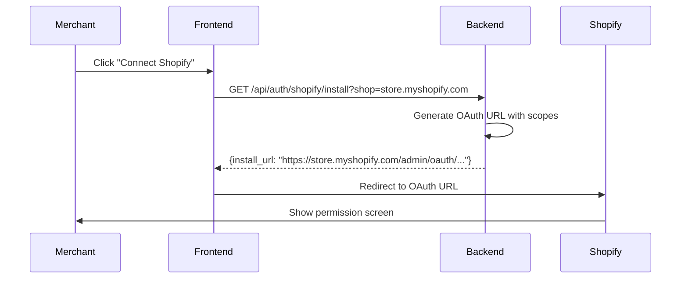
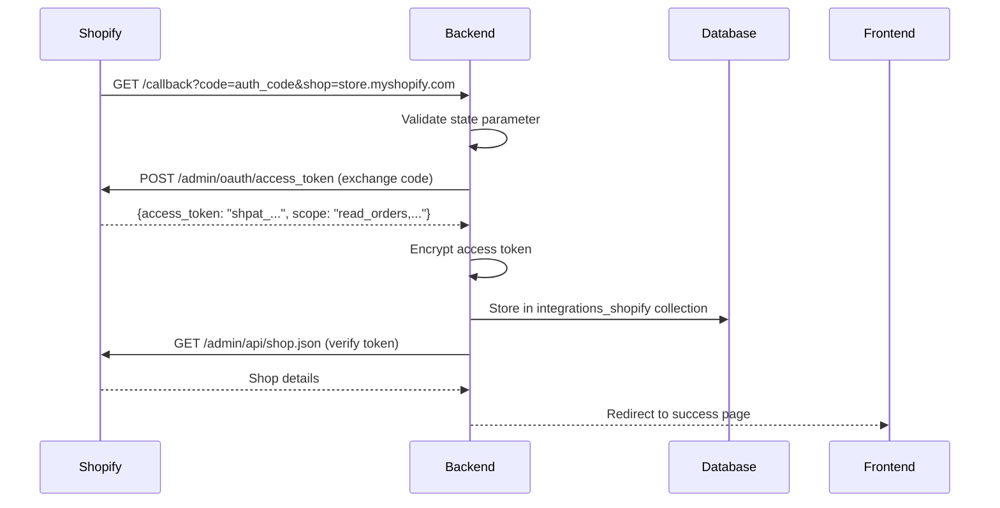

# Shopify Integration Guide

*Last updated: 2025-01-11*

## Integration Overview

This app integrates with Shopify using OAuth 2.0 for authentication and GraphQL API for data operations. All integration data is stored per tenant with encrypted access tokens.

## OAuth 2.0 Setup

### App Configuration

**Required Environment Variables:**
```bash
# Backend .env file
SHOPIFY_API_KEY=your_api_key_here
SHOPIFY_API_SECRET=your_api_secret_here  
APP_URL=https://your-app-domain.com
SHOPIFY_API_VERSION=2024-10
```

**Shopify App Settings:**
- **App URL**: `https://your-app-domain.com/app`
- **Allowed redirection URLs**: 
  - `https://your-app-domain.com/api/auth/shopify/callback`
- **Webhook URLs**: `https://your-app-domain.com/api/webhooks/`

### OAuth Scopes

The app requests these scopes during installation:

```javascript
const REQUIRED_SCOPES = [
  'read_orders',        // Access order data
  'read_products',      // Access product information  
  'read_customers',     // Access customer details
  'read_fulfillments',  // Access fulfillment status
  'read_inventory',     // Check product availability
  'write_returns'       // Create return objects (future)
];
```

**Scope Justifications:**
- `read_orders`: Essential for order lookup and return eligibility
- `read_products`: Product details for return processing
- `read_customers`: Customer validation and communication
- `read_fulfillments`: Determine if items can be returned
- `read_inventory`: Check stock for exchanges
- `write_returns`: Future feature for creating Shopify return objects

## OAuth Flow Implementation

### 1. Installation Initiation



**Install URL Generation:**
```python
# controllers/shopify_integration_controller.py
def generate_install_url(shop_domain: str):
    return (
        f"https://{shop_domain}/admin/oauth/authorize?"
        f"client_id={SHOPIFY_API_KEY}&"
        f"scope={','.join(REQUIRED_SCOPES)}&"
        f"redirect_uri={APP_URL}/api/auth/shopify/callback&"
        f"state={generate_state_token()}"
    )
```

### 2. OAuth Callback Handling



**Callback Implementation:**
```python
# controllers/shopify_integration_controller.py
@router.get("/callback")
async def oauth_callback(
    code: str,
    shop: str, 
    state: str,
    hmac: str
):
    # 1. Validate HMAC signature
    if not verify_hmac(request.query_string, hmac):
        raise HTTPException(400, "Invalid HMAC")
    
    # 2. Exchange code for access token
    token_response = await exchange_code_for_token(code, shop)
    access_token = token_response['access_token']
    
    # 3. Encrypt and store token
    encrypted_token = encrypt_token(access_token)
    
    # 4. Save integration data
    await db.integrations_shopify.update_one(
        {"tenant_id": tenant_id},
        {
            "$set": {
                "shop_domain": shop,
                "access_token": encrypted_token,
                "status": "connected",
                "scopes": token_response['scope'].split(','),
                "installed_at": datetime.utcnow()
            }
        },
        upsert=True
    )
    
    # 5. Redirect to success page
    return RedirectResponse(f"{APP_URL}/app/dashboard?connected=true")
```

## GraphQL API Integration

### Authentication Pattern

```python
# services/shopify_service.py
class ShopifyService:
    async def make_graphql_request(self, query: str, variables: dict = None):
        # Get encrypted token from database
        integration = await db.integrations_shopify.find_one(
            {"tenant_id": self.tenant_id}
        )
        
        # Decrypt access token
        access_token = self.auth_service.decrypt_token(
            integration['access_token']
        )
        
        # Make GraphQL request
        headers = {
            'X-Shopify-Access-Token': access_token,
            'Content-Type': 'application/json'
        }
        
        response = await httpx.post(
            f"https://{integration['shop_domain']}/admin/api/{API_VERSION}/graphql.json",
            json={'query': query, 'variables': variables},
            headers=headers
        )
        
        return response.json()
```

### Order Lookup Query

The core query for customer return portal:

```graphql
query GetOrderForReturn($id: ID!) {
  order(id: $id) {
    id
    name
    email
    createdAt
    customer {
      id
      firstName
      lastName  
      email
    }
    lineItems(first: 50) {
      edges {
        node {
          id
          title
          quantity
          fulfillableQuantity
          variant {
            id
            title
            sku
            price
            inventoryQuantity
          }
          product {
            id
            title
            productType
            tags
          }
        }
      }
    }
    totalPriceSet {
      shopMoney {
        amount
        currencyCode
      }
    }
    fulfillmentStatus
    displayFulfillmentStatus
    fulfillments(first: 10) {
      id
      status
      createdAt
      trackingInfo {
        company
        number
        url
      }
    }
  }
}
```

**Variables:**
```json
{
  "id": "gid://shopify/Order/5813364687033"
}
```

### Order Number to ID Conversion

Shopify's GraphQL requires the internal ID (like `5813364687033`) but customers know the order number (like `1001`). The conversion is handled in the service:

```python
async def find_order_by_number(self, order_number: str, customer_email: str = None):
    # First try local database lookup
    order = await self.get_cached_order(order_number, customer_email)
    if order:
        return order
    
    # If not cached, search Shopify via GraphQL
    # Use orders query with first: parameter to search
    query = """
    query SearchOrders($query: String!) {
      orders(first: 10, query: $query) {
        edges {
          node {
            id
            name
            customer {
              email
            }
            # ... other fields
          }
        }
      }
    }
    """
    
    # Search by order number and email
    search_query = f"name:{order_number}"
    if customer_email:
        search_query += f" email:{customer_email}"
    
    result = await self.make_graphql_request(query, {
        "query": search_query
    })
    
    return self.transform_graphql_order(result)
```

## Webhook Integration

### Webhook Registration

```python
# During OAuth callback, register webhooks
async def register_webhooks(shop_domain: str, access_token: str):
    webhooks = [
        {
            "topic": "orders/create",
            "address": f"{APP_URL}/api/webhooks/orders/create",
            "format": "json"
        },
        {
            "topic": "orders/updated", 
            "address": f"{APP_URL}/api/webhooks/orders/updated",
            "format": "json"
        },
        {
            "topic": "orders/fulfilled",
            "address": f"{APP_URL}/api/webhooks/orders/fulfilled", 
            "format": "json"
        },
        {
            "topic": "app/uninstalled",
            "address": f"{APP_URL}/api/webhooks/app/uninstalled",
            "format": "json"
        }
    ]
    
    for webhook in webhooks:
        await register_single_webhook(shop_domain, access_token, webhook)
```

### HMAC Verification

```python
# controllers/webhook_controller.py
def verify_webhook_hmac(payload: bytes, hmac_header: str) -> bool:
    """Verify Shopify webhook HMAC signature"""
    calculated_hmac = hmac.new(
        SHOPIFY_API_SECRET.encode('utf-8'),
        payload,
        hashlib.sha256
    ).digest()
    
    expected_hmac = base64.b64encode(calculated_hmac)
    provided_hmac = hmac_header.encode('utf-8')
    
    return hmac.compare_digest(expected_hmac, provided_hmac)

@router.post("/orders/create")
async def handle_order_created(
    request: Request,
    x_shopify_hmac_sha256: str = Header(...),
    x_shopify_shop_domain: str = Header(...)
):
    # Verify HMAC
    payload = await request.body()
    if not verify_webhook_hmac(payload, x_shopify_hmac_sha256):
        raise HTTPException(401, "Invalid HMAC signature")
    
    # Process webhook
    order_data = await request.json()
    await process_order_webhook(order_data, x_shopify_shop_domain)
```

## Error Handling & Rate Limiting

### GraphQL Error Handling

```python
async def handle_graphql_response(self, response_data: dict):
    """Handle GraphQL response with errors"""
    if 'errors' in response_data:
        errors = response_data['errors']
        
        for error in errors:
            error_code = error.get('extensions', {}).get('code')
            
            if error_code == 'THROTTLED':
                # Implement exponential backoff
                await asyncio.sleep(2 ** self.retry_count)
                raise ShopifyThrottleError("API rate limit exceeded")
            
            elif error_code == 'ACCESS_DENIED':
                raise ShopifyAuthError("Invalid access token or insufficient permissions")
            
            elif error_code == 'NOT_FOUND':
                return None  # Order not found
            
            else:
                raise ShopifyAPIError(f"GraphQL error: {error['message']}")
    
    return response_data.get('data')
```

### Cost Analysis Tracking

Shopify GraphQL has query cost limits. Track costs to avoid throttling:

```python
async def track_query_cost(self, response_data: dict):
    """Track GraphQL query costs"""
    extensions = response_data.get('extensions', {})
    cost = extensions.get('cost', {})
    
    if cost:
        current_cost = cost.get('actualQueryCost', 0)
        available_cost = cost.get('throttleStatus', {}).get('currentlyAvailable', 1000)
        
        # Log if approaching limit
        if available_cost < 100:
            logger.warning(f"Shopify API cost running low: {available_cost} remaining")
        
        # Store cost data for analytics
        await self.store_cost_metrics(current_cost, available_cost)
```

## Testing Shopify Integration

### Local Development Setup

```bash
# Use ngrok for webhook testing
ngrok http 8001

# Update .env with ngrok URL
APP_URL=https://abc123.ngrok.io

# Test OAuth flow
curl "http://localhost:8001/api/auth/shopify/install?shop=rms34.myshopify.com"
```

### Test Queries

```bash
# Test connection
curl -H "X-Tenant-Id: tenant-rms34" \
     http://localhost:8001/api/integrations/shopify/status

# Test order lookup  
curl -X POST \
     -H "Content-Type: application/json" \
     -H "X-Tenant-Id: tenant-rms34" \
     -d '{"order_number": "1001", "customer_email": "test@example.com"}' \
     http://localhost:8001/api/elite/portal/returns/lookup-order

# Test GraphQL directly (with real token)
curl -X POST \
     -H "X-Shopify-Access-Token: shpat_..." \
     -H "Content-Type: application/json" \
     -d '{"query": "{ shop { name } }"}' \
     https://rms34.myshopify.com/admin/api/2024-10/graphql.json
```

### Webhook Testing

```bash
# Simulate webhook with proper HMAC
python scripts/test_webhook.py --topic=orders/create --shop=rms34.myshopify.com

# Check webhook logs
tail -f /var/log/supervisor/backend.err.log | grep webhook
```

## Common Integration Issues

### Redirect URI Mismatch
**Error:** `redirect_uri is not whitelisted`
**Solution:** 
1. Check Shopify app settings match exactly
2. Ensure APP_URL environment variable is correct
3. No trailing slashes in URLs

### Invalid Access Token
**Error:** `401 Unauthorized` from Shopify API
**Causes:**
- Token not properly decrypted
- App uninstalled but token not cleaned up
- Scope changes requiring re-authorization

**Debug:**
```python
# Check token encryption/decryption
encrypted_token = integration['access_token']
decrypted_token = auth_service.decrypt_token(encrypted_token)
print(f"Token starts with: {decrypted_token[:10]}...")
```

### HMAC Verification Failures
**Error:** Webhook returns 401
**Causes:**
- Wrong secret used for verification
- Payload modified before verification
- Character encoding issues

**Debug:**
```python
# Log HMAC details
logger.info(f"Received HMAC: {hmac_header}")
logger.info(f"Calculated HMAC: {calculated_hmac.hex()}")
logger.info(f"Payload length: {len(payload)}")
```

### GraphQL Cost Throttling
**Error:** `THROTTLED` in GraphQL response
**Solution:**
- Implement exponential backoff
- Reduce query complexity
- Cache results to avoid repeated queries

## Security Best Practices

### Token Storage
- All access tokens encrypted with Fernet
- Encryption key stored in environment variables
- No tokens in logs or error messages

### Webhook Security
- Always verify HMAC signatures
- Use HTTPS for all webhook endpoints
- Rate limit webhook endpoints

### Data Privacy
- Only request necessary scopes
- Minimize customer data storage
- Implement data retention policies

---

**Next**: See [RETURNS_PORTAL.md](./RETURNS_PORTAL.md) for customer portal implementation.